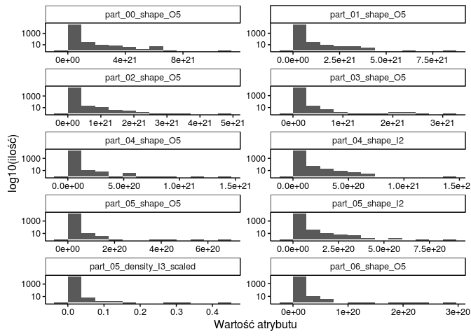

# report
Szymon Kownacki  
January 12, 2016  

Załadowanie potrzebnych bibliotek

```r
library(dplyr)
library(ggplot2)
library(RColorBrewer)
library(gridExtra)
library(reshape2)
```

Lista wykorzystanych bibliotek

```r
search()
```

```
##  [1] ".GlobalEnv"           "package:reshape2"     "package:gridExtra"   
##  [4] "package:RColorBrewer" "package:ggplot2"      "package:dplyr"       
##  [7] "package:stats"        "package:graphics"     "package:grDevices"   
## [10] "package:utils"        "package:datasets"     "package:methods"     
## [13] "Autoloads"            "package:base"
```

Zapewnienie powtarzalności wyników

```r
set.seed(747)
```

Załadowanie zbioru danych

```r
df <- read.csv("all_summary.txt", header = TRUE, sep = ";")
```

Usunięcie rekordów zawierających res_name = ["DA","DC","DT", "DU", "DG", "DI","UNK", "UNX", "UNL", "PR", "PD", "Y1", "EU", "N", "15P", "UQ", "PX4", "NAN"]

```r
resNamesToFilterOut <- c("DA","DC","DT", "DU", "DG", "DI","UNK", "UNX", "UNL", "PR", "PD", "Y1", "EU", "N", "15P", "UQ", "PX4", "NAN")
namesFiltered <- df %>% filter(!is.element(res_name, resNamesToFilterOut))
```

Wyliczenie unikatowych par wartości (pdb_code, res_name)

```r
distinctPdbAndResName <- namesFiltered %>% select(c(pdb_code, res_name)) %>% distinct()
```

Ile przykładów na każda z klas

```r
counts <- count(distinctPdbAndResName, res_name)
knitr::kable(arrange(counts, desc(n)))
```


res_name       n
---------  -----
SO4         1183
ZN           849
GOL          778
CA           661
MG           402
CL           400
NAG          396
PO4          301
HEM          296
EDO          274
NA           238
MN           182
ACT          167
FAD          157
ADP          138
FE           120
K            119
ATP          106
CU           104
PEG           90
NAP           86
CD            81
NAD           80
MES           79
NI            76
FMN           73
EPE           72
BME           67
PG4           67
TRS           63
MAN           62
CO            61
NDP           61
SEP           61
PLP           59
CIT           56
GDP           55
MPD           55
SAH           54
FE2           52
TPO           50
IOD           49
SF4           49
PGE           48
GLC           46
DMS           42
GNP           41
BOG           40
PCA           40
BGC           39
AMP           38
GTP           37
ACY           36
ANP           36
BMA           36
COA           35
CSD           35
FES           35
1PE           34
FMT           34
HG            34
BR            32
GAL           32
HEC           32
CME           30
UDP           30
PTR           29
CSO           28
NO3           28
P6G           28
FUC           27
H4B           27
MRD           27
ACE           26
FLC           26
IMD           25
SAM           25
SIA           24
MLI           23
NDG           23
LLP           22
MLY           22
IPA           21
KCX           21
TLA           21
MAL           19
PLM           19
POP           18
BEN           17
OCS           17
SCN           17
SUC           17
CAC           16
DTT           16
GSH           16
LMT           16
NAI           16
UMP           16
CRO           15
NCO           15
8OG           14
APC           14
BTN           14
F3S           14
ABA           13
ACO           13
ALY           13
DIO           13
NHE           13
ADN           12
HED           12
M3L           12
TYS           12
BA            11
C8E           11
CTP           11
DOC           11
MLA           11
MLZ           11
SIN           11
TPP           11
XYP           11
A2G           10
BEZ           10
BRU           10
DTP           10
LDA           10
MTX           10
NRQ           10
RET           10
THP           10
5CM            9
ACP            9
AU             9
C5P            9
CDL            9
CSX            9
CU1            9
CUA            9
F6P            9
NLE            9
PT             9
SR             9
BCL            8
BPH            8
BTB            8
DAL            8
FME            8
HEZ            8
PE4            8
PYR            8
SRM            8
UPG            8
3DR            7
ADE            7
B12            7
CAS            7
CCC            7
CO3            7
CR2            7
CS             7
CSS            7
DCP            7
DHE            7
GSP            7
HIC            7
IHP            7
IMP            7
MBO            7
PEP            7
SGN            7
U10            7
U5P            7
UTP            7
VO4            7
XE             7
YCM            7
2NC            6
5GP            6
BHG            6
C2E            6
CAD            6
DHT            6
DMU            6
GLA            6
GPP            6
HC4            6
HYP            6
IDS            6
KAI            6
TAM            6
TTP            6
XYS            6
YB             6
2HP            5
6OG            5
A23            5
A3P            5
A8S            5
AGS            5
BCT            5
BDP            5
C2F            5
CAM            5
CB3            5
CIR            5
CMP            5
CPT            5
DGT            5
FBP            5
FOL            5
GSW            5
GTT            5
GTX            5
IPH            5
LAT            5
MLE            5
MRG            5
NGT            5
OLC            5
PGA            5
PGV            5
PSU            5
S9L            5
SGM            5
SNC            5
SRT            5
STU            5
TAR            5
TES            5
TL             5
TMP            5
UMQ            5
0G6            4
12P            4
1N1            4
2DT            4
2PE            4
5BU            4
5MU            4
AKG            4
AP5            4
APR            4
ARS            4
ATM            4
AZA            4
AZI            4
BCN            4
BLA            4
CDP            4
CHD            4
CLF            4
COH            4
CP             4
CTT            4
CXM            4
CXS            4
CYC            4
DTD            4
DUP            4
DUT            4
DXC            4
EOH            4
GMP            4
GUN            4
HDD            4
HEA            4
IAS            4
IPE            4
LBT            4
LDT            4
MLT            4
MOO            4
MPO            4
MTA            4
MVA            4
MYR            4
PAF            4
PAR            4
PEE            4
PG6            4
PLC            4
PMP            4
PPV            4
ROC            4
S3P            4
SME            4
T44            4
TAU            4
TPQ            4
TRQ            4
TYD            4
URE            4
YT3            4
ZST            4
017            3
0AF            3
1BO            3
1PG            3
2GP            3
3CN            3
3CO            3
3TL            3
5IU            3
A2M            3
A5P            3
ACD            3
AG2            3
ALC            3
AME            3
ARB            3
ASJ            3
B3P            3
B4P            3
BCD            3
BMP            3
BNZ            3
BTI            3
BU1            3
BU3            3
C2O            3
CAF            3
CAP            3
CCS            3
CGU            3
CLA            3
CPS            3
CR8            3
D3T            3
DAN            3
DDE            3
DDG            3
DEP            3
DMA            3
EAA            3
EMC            3
EPH            3
F09            3
FDA            3
FEO            3
FNR            3
FO1            3
G3P            3
G6P            3
GAI            3
GBX            3
GCP            3
GD             3
GLP            3
GYS            3
HAS            3
HO             3
KPI            3
LHG            3
MA4            3
MBN            3
ME2            3
MHO            3
MIY            3
MJI            3
MMC            3
MTT            3
N7I            3
N8E            3
NGA            3
NIO            3
NPO            3
NVP            3
OCY            3
OHT            3
ORO            3
OXM            3
OXY            3
P22            3
P34            3
P4C            3
PA5            3
PC1            3
PEK            3
PG5            3
PHD            3
PMB            3
PO3            3
POL            3
PSC            3
R18            3
RB             3
RBF            3
SAC            3
SCH            3
SFG            3
SGC            3
SLB            3
SNN            3
SPM            3
SPN            3
STA            3
STE            3
TCL            3
TGL            3
TOP            3
TTD            3
UD1            3
WO4            3
XCP            3
XG4            3
XMP            3
XXH            3
ZMR            3
08Q            2
0MO            2
128            2
13P            2
144            2
149            2
1CA            2
1GP            2
1MA            2
250            2
2AL            2
2AN            2
2CV            2
2DA            2
2OP            2
2PG            2
3HX            2
3PG            2
3TR            2
4IP            2
4MO            2
4NP            2
5FU            2
5MY            2
64T            2
A1R            2
A2P            2
AB1            2
ABJ            2
ABN            2
ACR            2
AD9            2
ADA            2
AG7            2
AKR            2
ALF            2
AM2            2
ANK            2
APJ            2
AS0            2
ASC            2
ASD            2
ASO            2
ASX            2
AT2            2
AT3            2
ATG            2
B3E            2
BCB            2
BCO            2
BCR            2
BCZ            2
BFD            2
BIL            2
BMQ            2
BMT            2
BMU            2
BO2            2
BO3            2
BPB            2
C12            2
CAQ            2
CAZ            2
CBE            2
CBI            2
CE5            2
CFN            2
CHT            2
CLR            2
CNC            2
CO8            2
CR7            2
CRQ            2
CRS            2
CSF            2
CTO            2
CX2            2
CZH            2
D10            2
D15            2
DAO            2
DAU            2
DCE            2
DCM            2
DCQ            2
DEX            2
DGA            2
DGD            2
DHC            2
DKI            2
DLY            2
DPO            2
DPR            2
DSN            2
DTU            2
DTV            2
DXP            2
EBP            2
EDT            2
ET             2
ETF            2
ETM            2
F42            2
FCO            2
FK5            2
FMR            2
FRU            2
FUL            2
FWF            2
G2P            2
G39            2
G3H            2
G4P            2
G6D            2
G75            2
G85            2
GB             2
GCD            2
GH3            2
GNH            2
GPJ            2
GRG            2
GTB            2
H2U            2
HBA            2
HCA            2
HCI            2
HHA            2
HPA            2
HTG            2
HTO            2
HY0            2
I3P            2
ICT            2
ILO            2
IMO            2
INS            2
IXM            2
IZA            2
JI2            2
KAP            2
KD0            2
KDO            2
KN3            2
KR             2
L2P            2
LI             2
LI1            2
LMA            2
LMR            2
LMU            2
LOC            2
LPA            2
LPR            2
M7G            2
MA7            2
MAA            2
MAE            2
MDO            2
MEN            2
MF4            2
MIS            2
MLR            2
MOS            2
MPG            2
MTN            2
MTY            2
MYA            2
NAA            2
NBB            2
NCN            2
NDS            2
NH2            2
NH4            2
NO2            2
NOJ            2
NS5            2
NXC            2
O2C            2
OAA            2
OLA            2
OLP            2
OMG            2
ORP            2
OXL            2
OXZ            2
P              2
P4O            2
PAP            2
PB             2
PC             2
PCF            2
PCG            2
PE3            2
PEU            2
PG0            2
PGO            2
PGR            2
PHI            2
PHS            2
PIO            2
PLR            2
PNM            2
PNN            2
PNU            2
PPS            2
PRF            2
PRP            2
PT6            2
PTY            2
QEI            2
QSI            2
RAM            2
RBZ            2
RDC            2
RIB            2
RIS            2
RIT            2
SAR            2
SCR            2
SKM            2
SLL            2
SM             2
SMC            2
SPD            2
SQO            2
SRY            2
STI            2
TAD            2
TAK            2
TBA            2
TBU            2
TCE            2
TDP            2
TEO            2
TFA            2
TFP            2
TG1            2
THJ            2
THM            2
TRE            2
TRH            2
TX2            2
U2F            2
UAP            2
UC1            2
UFR            2
UMS            2
UQ2            2
UR3            2
URA            2
URF            2
XAN            2
XFN            2
XPC            2
XPE            2
XUL            2
YNM            2
ZIP            2
ZLD            2
ZOL            2
006            1
010            1
01K            1
027            1
02P            1
031            1
03P            1
03Q            1
03R            1
043            1
048            1
04C            1
04L            1
056            1
057            1
05B            1
065            1
06W            1
074            1
07V            1
085            1
08B            1
08E            1
08R            1
091            1
098            1
09B            1
09M            1
09N            1
0B3            1
0BB            1
0BT            1
0C2            1
0C5            1
0DJ            1
0ET            1
0F9            1
0FN            1
0FQ            1
0FX            1
0G1            1
0GE            1
0H6            1
0HH            1
0HV            1
0IW            1
0J5            1
0JJ            1
0JK            1
0JO            1
0K1            1
0KH            1
0L6            1
0LB            1
0LG            1
0LI            1
0LJ            1
0LL            1
0LM            1
0M8            1
0ME            1
0MR            1
0N3            1
0N6            1
0NH            1
0NQ            1
0O4            1
0OC            1
0OJ            1
0OQ            1
0OU            1
0QA            1
0QE            1
0QK            1
0RF            1
0RQ            1
0RS            1
0S7            1
0SC            1
0SV            1
0T4            1
0TD            1
0TR            1
0TU            1
0UL            1
0VE            1
0VH            1
0WH            1
0WN            1
0WO            1
0WU            1
0WZ            1
0Y4            1
0ZS            1
10E            1
10L            1
117            1
11E            1
11H            1
11M            1
11O            1
11S            1
126            1
12F            1
12V            1
13C            1
13U            1
140            1
14D            1
14H            1
14Q            1
14W            1
14Z            1
15H            1
15R            1
16B            1
16H            1
16L            1
17J            1
17L            1
182            1
188            1
189            1
18A            1
18F            1
18H            1
18O            1
198            1
19E            1
19G            1
19J            1
19Q            1
19T            1
1A4            1
1AC            1
1BB            1
1BI            1
1BK            1
1BQ            1
1BS            1
1BX            1
1CI            1
1CO            1
1CP            1
1CS            1
1DF            1
1DP            1
1DQ            1
1DZ            1
1E8            1
1EO            1
1ET            1
1EU            1
1F2            1
1FL            1
1FZ            1
1G5            1
1H3            1
1HW            1
1JD            1
1KG            1
1KX            1
1LG            1
1M8            1
1MF            1
1MH            1
1MY            1
1N4            1
1NK            1
1NT            1
1O6            1
1P0            1
1PR            1
1PS            1
1PV            1
1QK            1
1QN            1
1QO            1
1QZ            1
1RC            1
1RH            1
1RO            1
1RS            1
1RY            1
1SB            1
1SM            1
1SS            1
1TB            1
1TL            1
1TY            1
1U8            1
1V1            1
1VK            1
1VY            1
1WH            1
1WO            1
1WX            1
1YX            1
200            1
21P            1
21Q            1
21U            1
23Q            1
23R            1
246            1
24I            1
24M            1
24P            1
24X            1
24Z            1
25A            1
25E            1
25H            1
25P            1
25R            1
25U            1
263            1
265            1
27U            1
285            1
28C            1
28D            1
28F            1
29N            1
29Q            1
29X            1
2A2            1
2AD            1
2AK            1
2AM            1
2B4            1
2BA            1
2BO            1
2BP            1
2BR            1
2CD            1
2CK            1
2CL            1
2CS            1
2D0            1
2D2            1
2D3            1
2DB            1
2DE            1
2FA            1
2FY            1
2FZ            1
2G0            1
2GE            1
2HC            1
2HF            1
2ID            1
2IP            1
2J8            1
2JR            1
2JZ            1
2K1            1
2KD            1
2KJ            1
2KK            1
2LC            1
2LJ            1
2M8            1
2MG            1
2MR            1
2NF            1
2OB            1
2OK            1
2OO            1
2OT            1
2OU            1
2OX            1
2Q4            1
2QB            1
2QG            1
2SB            1
2ST            1
2TS            1
2TW            1
2UJ            1
2UZ            1
2VR            1
2WQ            1
2XA            1
2XE            1
2XS            1
2XY            1
2Y1            1
2YH            1
2YR            1
2ZT            1
2ZV            1
312            1
313            1
31J            1
31U            1
321            1
32G            1
332            1
334            1
33C            1
33F            1
344            1
34H            1
34I            1
357            1
35I            1
361            1
364            1
37D            1
388            1
38G            1
38R            1
38T            1
393            1
394            1
398            1
39K            1
3A2            1
3AB            1
3AD            1
3BC            1
3BE            1
3BM            1
3BV            1
3BZ            1
3CM            1
3CU            1
3D1            1
3D8            1
3DG            1
3DH            1
3E1            1
3E5            1
3EB            1
3EY            1
3F8            1
3FE            1
3FN            1
3FV            1
3FX            1
3GB            1
3GP            1
3GQ            1
3GW            1
3HC            1
3J7            1
3J9            1
3JN            1
3JR            1
3JY            1
3LZ            1
3M2            1
3M4            1
3MC            1
3MI            1
3MS            1
3N6            1
3NG            1
3NM            1
3NS            1
3NU            1
3NY            1
3O4            1
3OB            1
3OD            1
3PD            1
3PI            1
3PS            1
3PT            1
3QC            1
3RA            1
3RS            1
3S2            1
3SA            1
3SD            1
3SL            1
3SZ            1
3T9            1
3U1            1
3UN            1
3V0            1
3VB            1
3WD            1
3WP            1
3WR            1
3XD            1
3XU            1
3Z3            1
3Z8            1
3ZB            1
405            1
406            1
408            1
40A            1
40B            1
40C            1
40G            1
40T            1
40U            1
416            1
426            1
428            1
42K            1
42Z            1
431            1
444            1
447            1
451            1
452            1
48T            1
4A3            1
4AW            1
4BF            1
4BT            1
4BZ            1
4C0            1
4CC            1
4CM            1
4CQ            1
4CS            1
4DB            1
4FF            1
4FJ            1
4FY            1
4FZ            1
4G5            1
4HD            1
4HN            1
4HY            1
4KA            1
4OC            1
4PI            1
4SB            1
4SP            1
4SU            1
4TT            1
4UB            1
509            1
513            1
518            1
523            1
52A            1
52B            1
52P            1
52X            1
534            1
53I            1
53J            1
53V            1
552            1
569            1
57D            1
581            1
585            1
596            1
598            1
59A            1
59W            1
5AD            1
5B1            1
5B2            1
5BA            1
5DR            1
5EL            1
5FC            1
5FD            1
5FE            1
5GF            1
5H4            1
5HE            1
5HK            1
5MA            1
5MC            1
5NB            1
5NH            1
5P3            1
5P8            1
5PA            1
5RP            1
5SE            1
5YL            1
611            1
614            1
626            1
647            1
64U            1
65B            1
675            1
678            1
680            1
6A5            1
6AS            1
6CF            1
6CN            1
6CW            1
6DJ            1
6HK            1
6IA            1
6MA            1
6MO            1
6MZ            1
6NA            1
6OB            1
6OC            1
6P3            1
6PC            1
6PG            1
6PL            1
6QM            1
6T6            1
6TG            1
75A            1
76V            1
770            1
780            1
78M            1
78N            1
79X            1
79Z            1
7A5            1
7CP            1
7DA            1
7DE            1
7DR            1
7HA            1
7MD            1
7ME            1
7PQ            1
7RG            1
7X3            1
7X4            1
7X5            1
7X6            1
7YG            1
801            1
809            1
815            1
81R            1
824            1
839            1
845            1
861            1
879            1
880            1
88W            1
897            1
8AR            1
8CX            1
8DA            1
8HG            1
8ME            1
8PH            1
8UP            1
92G            1
92P            1
935            1
93N            1
942            1
99B            1
9DP            1
9MR            1
9MX            1
9NE            1
9PA            1
9RA            1
A09            1
A12            1
A14            1
A22            1
A26            1
A3T            1
A48            1
A49            1
A5M            1
A60            1
A6J            1
A6M            1
A8B            1
A9U            1
AA1            1
AAA            1
AAL            1
AB2            1
ABB            1
ABG            1
AC2            1
ACH            1
ACM            1
ACN            1
ACV            1
ADK            1
ADX            1
AEI            1
AEJ            1
AES            1
AF             1
AF3            1
AFR            1
AG0            1
AG6            1
AGD            1
AGG            1
AGL            1
AGT            1
AHB            1
AHR            1
AHU            1
AIA            1
AIB            1
AIG            1
AIQ            1
AIS            1
AJD            1
AKH            1
ALQ            1
AM7            1
AMF            1
AMG            1
AMI            1
AMQ            1
AMZ            1
AN2            1
ANO            1
ANQ            1
ANU            1
AOC            1
AOE            1
AOV            1
AQH            1
AQM            1
AR6            1
ARD            1
ARF            1
AS1            1
ASA            1
ASV            1
AT1            1
ATR            1
ATV            1
AV2            1
AVC            1
AVN            1
AVU            1
AVW            1
AVX            1
AX2            1
AX5            1
AXA            1
AXD            1
AXX            1
AYA            1
AYH            1
AZ5            1
AZX            1
AZZ            1
B13            1
B1R            1
B27            1
B2A            1
B2P            1
B3L            1
B3N            1
B3Q            1
B3Y            1
B41            1
B5F            1
B5S            1
B60            1
B73            1
B78            1
B7G            1
B85            1
B86            1
B93            1
BA3            1
BAL            1
BAM            1
BAP            1
BAT            1
BAV            1
BB0            1
BB6            1
BB9            1
BBL            1
BBQ            1
BBZ            1
BC2            1
BC6            1
BD6            1
BDB            1
BDE            1
BDW            1
BDX            1
BE1            1
BE2            1
BEB            1
BEI            1
BEM            1
BER            1
BES            1
BFG            1
BG6            1
BGM            1
BGU            1
BGV            1
BH9            1
BHB            1
BHE            1
BHF            1
BHO            1
BI1            1
BI4            1
BI8            1
BIK            1
BIO            1
BJA            1
BK5            1
BLK            1
BLL            1
BLS            1
BM4            1
BNG            1
BNL            1
BOU            1
BP1            1
BPU            1
BPY            1
BQN            1
BR8            1
BRH            1
BRK            1
BRL            1
BRV            1
BSA            1
BSF            1
BSH            1
BSM            1
BT5            1
BTK            1
BTM            1
BTQ            1
BTS            1
BTX            1
BU4            1
BUD            1
BUM            1
BV5            1
BVD            1
BX3            1
BX7            1
BXA            1
BXB            1
BXY            1
BZ2            1
BZ3            1
BZ5            1
BZB            1
BZG            1
BZH            1
C0R            1
C0T            1
C15            1
C17            1
C1E            1
C1P            1
C1X            1
C27            1
C28            1
C2C            1
C2G            1
C38            1
C42            1
C46            1
C6B            1
C6L            1
C70            1
C8C            1
C9M            1
CA2            1
CA8            1
CAO            1
CB4            1
CB7            1
CB8            1
CBD            1
CBH            1
CBK            1
CBQ            1
CBR            1
CBY            1
CCD            1
CCL            1
CCQ            1
CDM            1
CE1            1
CEE            1
CEF            1
CER            1
CF2            1
CFA            1
CFQ            1
CFV            1
CFZ            1
CH1            1
CHL            1
CHV            1
CJC            1
CK5            1
CK7            1
CL6            1
CL7            1
CLY            1
CM0            1
CM5            1
CMA            1
CMC            1
CMJ            1
CMT            1
CNH            1
CNT            1
CO4            1
COB            1
COC            1
COF            1
COU            1
CP3            1
CPQ            1
CQ2            1
CQU            1
CR             1
CR4            1
CRF            1
CRN            1
CSU            1
CSZ            1
CT0            1
CT4            1
CTE            1
CTM            1
CTN            1
CTZ            1
CUO            1
CXG            1
CXT            1
CY3            1
CY8            1
CYR            1
D09            1
D1C            1
D1D            1
D1S            1
D1T            1
D30            1
D3M            1
D3Y            1
D42            1
D44            1
D46            1
D4M            1
D5M            1
D80            1
D87            1
DAH            1
DAK            1
DAP            1
DAQ            1
DAR            1
DAS            1
DB8            1
DBJ            1
DBR            1
DC8            1
DCR            1
DCS            1
DCT            1
DCZ            1
DDR            1
DDY            1
DDZ            1
DE3            1
DFP            1
DGJ            1
DGL            1
DGP            1
DH2            1
DHB            1
DHF            1
DHK            1
DHY            1
DIF            1
DIH            1
DIL            1
DIX            1
DJK            1
DKD            1
DKT            1
DLG            1
DLI            1
DM2            1
DME            1
DMG            1
DNB            1
DND            1
DNP            1
DOO            1
DOT            1
DP2            1
DPD            1
DPN            1
DPX            1
DQH            1
DQO            1
DQR            1
DR4            1
DRX            1
DSC            1
DSD            1
DSG            1
DST            1
DSU            1
DT5            1
DTM            1
DTZ            1
DU3            1
DUD            1
DUR            1
DVP            1
DWD            1
DWF            1
DZE            1
DZO            1
E20            1
E36            1
E3O            1
E4H            1
E5G            1
EAX            1
ECC            1
ECH            1
EDA            1
EDV            1
EEA            1
EEE            1
EF3            1
EFG            1
EFT            1
EFZ            1
EGD            1
EIC            1
EIP            1
EK4            1
EK5            1
EME            1
EMF            1
EMT            1
ENO            1
ENP            1
EOL            1
EP1            1
EPA            1
EPB            1
EPD            1
EPZ            1
ERB            1
ERM            1
ERT            1
ERY            1
ESA            1
ESI            1
EST            1
ET1            1
ETS            1
ETX            1
EUG            1
EV2            1
EV4            1
EVJ            1
EWW            1
F01            1
F12            1
F2I            1
F2Y            1
F47            1
F4S            1
F6R            1
F76            1
F89            1
F9F            1
F9J            1
FAH            1
FAP            1
FAQ            1
FBO            1
FCE            1
FCL            1
FCN            1
FCT            1
FD1            1
FDG            1
FDP            1
FDR            1
FEA            1
FER            1
FFX            1
FG5            1
FGH            1
FGP            1
FHO            1
FHP            1
FHU            1
FID            1
FII            1
FIP            1
FJP            1
FK9            1
FKP            1
FLA            1
FLF            1
FLW            1
FMB            1
FMP            1
FNU            1
FOA            1
FOM            1
FON            1
FOS            1
FP1            1
FPF            1
FPM            1
FPQ            1
FRV            1
FS9            1
FSC            1
FSK            1
FSL            1
FSO            1
FT0            1
FT1            1
FTR            1
FTY            1
FUM            1
FVQ            1
FWD            1
FXN            1
FYN            1
FZN            1
G00            1
G07            1
G16            1
G18            1
G1C            1
G1P            1
G2F            1
G38            1
G3B            1
G3E            1
G3G            1
G3R            1
G3X            1
G4M            1
G7P            1
G9D            1
GA2            1
GA4            1
GA9            1
GAA            1
GAU            1
GAX            1
GBL            1
GBN            1
GC2            1
GCS            1
GD9            1
GDD            1
GDS            1
GDU            1
GEQ            1
GER            1
GFB            1
GG4            1
GGV            1
GI2            1
GIC            1
GK1            1
GLF            1
GLJ            1
GLX            1
GLZ            1
GM6            1
GMH            1
GN1            1
GNG            1
GOA            1
GOX            1
GP0            1
GP1            1
GP7            1
GPA            1
GPF            1
GPU            1
GRB            1
GS8            1
GSB            1
GSF            1
GTC            1
GTG            1
GTR            1
GUA            1
GVE            1
GW9            1
GWH            1
GWJ            1
GYC            1
GYN            1
H02            1
H06            1
H13            1
H16            1
H1L            1
H1S            1
H2S            1
H4W            1
H57            1
H5S            1
H5U            1
H9K            1
HA3            1
HA5            1
HAH            1
HAM            1
HAN            1
HAO            1
HAR            1
HBB            1
HBP            1
HBQ            1
HCS            1
HD1            1
HDB            1
HDE            1
HDS            1
HE3            1
HEX            1
HFT            1
HGB            1
HGI            1
HHG            1
HHS            1
HI3            1
HI5            1
HKA            1
HLT            1
HMD            1
HMT            1
HOC            1
HP7            1
HPH            1
HQY            1
HR7            1
HRD            1
HRG            1
HS4            1
HSX            1
HT             1
HTI            1
HTL            1
HUP            1
HW9            1
HXJ            1
HYG            1
I13            1
I1H            1
I1S            1
I22            1
I2H            1
I3K            1
I5I            1
I5U            1
I6P            1
I76            1
IAB            1
IAC            1
IBN            1
ICE            1
ICS            1
ID2            1
IFM            1
IH5            1
IHE            1
IHH            1
IHJ            1
IHM            1
IK2            1
IL2            1
IM2            1
IM9            1
IMI            1
IMN            1
IND            1
INE            1
INI            1
IOB            1
IOP            1
IP2            1
IP9            1
IPD            1
IPT            1
IQO            1
IQX            1
IR4            1
IRE            1
IRG            1
ISF            1
ISL            1
ISN            1
ITA            1
ITT            1
IUM            1
IVA            1
IVU            1
IW3            1
IW6            1
IYZ            1
IZ3            1
IZ5            1
J07            1
J21            1
J2T            1
J3Z            1
J72            1
JAK            1
JAN            1
JAO            1
JB1            1
JB2            1
JE2            1
JEF            1
JFK            1
JG1            1
JG3            1
JGZ            1
JHG            1
JHM            1
JK1            1
JK3            1
JLS            1
JM2            1
JNO            1
JPJ            1
JRO            1
JRS            1
JS4            1
JZ2            1
JZI            1
JZN            1
JZS            1
K03            1
K11            1
K17            1
K2Q            1
K4F            1
K55            1
K83            1
KAB            1
KBI            1
KDA            1
KDE            1
KDI            1
KGC            1
KI1            1
KJ8            1
KJZ            1
KLI            1
KMB            1
KNA            1
KRL            1
KRW            1
KTC            1
KTP            1
KWS            1
KWT            1
KWZ            1
KYS            1
KYT            1
L1R            1
L20            1
L21            1
L2C            1
L3P            1
LA2            1
LA6            1
LA8            1
LAC            1
LAE            1
LAG            1
LAI            1
LAR            1
LAZ            1
LBV            1
LC0            1
LC2            1
LDN            1
LE2            1
LFA            1
LFC            1
LGJ            1
LIV            1
LJH            1
LK0            1
LL3            1
LL9            1
LLO            1
LLT            1
LM2            1
LMB            1
LMS            1
LN6            1
LNP            1
LNR            1
LNV            1
LP4            1
LP5            1
LP6            1
LPM            1
LPN            1
LPQ            1
LRD            1
LRG            1
LS4            1
LSR            1
LT2            1
LU             1
LWW            1
LX9            1
LYA            1
LZ7            1
LZ8            1
LZC            1
LZD            1
LZJ            1
LZP            1
LZS            1
M06            1
M0E            1
M0N            1
M0Z            1
M23            1
M27            1
M2F            1
M2P            1
M2T            1
M3I            1
M3S            1
M42            1
M6D            1
M77            1
M7K            1
M7P            1
M7S            1
M7U            1
M87            1
MA5            1
MA6            1
MAG            1
MAP            1
MAR            1
MAU            1
MAY            1
MBB            1
MBG            1
MCA            1
MDF            1
MDL            1
MDS            1
MDX            1
ME5            1
ME6            1
MEF            1
MER            1
MEV            1
MFR            1
MFT            1
MG7            1
MGD            1
MGE            1
MGM            1
MGO            1
MGT            1
MGX            1
MH4            1
MI1            1
MI2            1
MI6            1
MIA            1
MK1            1
MK3            1
MK5            1
MK8            1
ML0            1
ML2            1
ML5            1
MLD            1
MLG            1
MME            1
MMP            1
MMY            1
MN0            1
MN3            1
MNA            1
MNB            1
MNR            1
MNU            1
MO7            1
MOG            1
MOM            1
MOW            1
MPR            1
MPZ            1
MQ7            1
MQ9            1
MQU            1
MR1            1
MRC            1
MS0            1
MT9            1
MTE            1
MTH            1
MTL            1
MU1            1
MUG            1
MUU            1
MVI            1
MXC            1
MYE            1
MYU            1
MYY            1
N11            1
N1C            1
N1M            1
N22            1
N2A            1
N2P            1
N2Y            1
N32            1
N4D            1
N4I            1
N5M            1
N5P            1
N6G            1
N7R            1
NA1            1
NAL            1
NAR            1
NB8            1
NBG            1
NBQ            1
NBZ            1
NC3            1
NC8            1
NC9            1
NCD            1
NDB            1
NDD            1
NDY            1
NEA            1
NEP            1
NEQ            1
NEU            1
NFG            1
NFM            1
NFQ            1
NFW            1
NFZ            1
NG1            1
NGF            1
NHT            1
NI7            1
NIA            1
NII            1
NJQ            1
NK             1
NK8            1
NKN            1
NKP            1
NKQ            1
NLC            1
NLG            1
NLP            1
NM7            1
NMN            1
NMY            1
NNB            1
NOB            1
NON            1
NPB            1
NPS            1
NPV            1
NPW            1
NQG            1
NSC            1
NSS            1
NT2            1
NTM            1
NTO            1
NTP            1
NUD            1
NUP            1
NUT            1
NXL            1
NXN            1
NXP            1
NXU            1
NXZ            1
NYM            1
NYS            1
NZT            1
O09            1
O13            1
O7M            1
O8H            1
O92            1
OA1            1
OAN            1
OAR            1
OAS            1
OBI            1
OBN            1
OC9            1
OCE            1
OCQ            1
OCR            1
ODK            1
ODR            1
OEC            1
OEM            1
OEU            1
OFM            1
OHH            1
OHI            1
OIL            1
OIO            1
OMT            1
OMX            1
OMY            1
OOP            1
OP1            1
OPC            1
OS             1
OSE            1
OXN            1
P23            1
P27            1
P2Q            1
P33            1
P38            1
P39            1
P3J            1
P41            1
P47            1
P4L            1
P5A            1
P6L            1
P7A            1
P86            1
P9C            1
P9G            1
PA7            1
PAI            1
PAL            1
PAN            1
PAO            1
PAU            1
PBE            1
PBZ            1
PC0            1
PCD            1
PCJ            1
PCP            1
PCR            1
PCW            1
PDA            1
PE8            1
PEB            1
PEF            1
PEY            1
PF8            1
PFB            1
PFD            1
PFF            1
PFU            1
PFY            1
PGH            1
PGP            1
PH2            1
PH7            1
PHB            1
PHK            1
PHO            1
PI7            1
PID            1
PII            1
PIN            1
PIV            1
PIW            1
PIZ            1
PJ7            1
PK1            1
PLG            1
PLL            1
PLZ            1
PM2            1
PM3            1
PMJ            1
PMM            1
PNK            1
PNS            1
PNT            1
PNW            1
PNX            1
PNY            1
POA            1
POV            1
POY            1
PPU            1
PQ0            1
PQ9            1
PRL            1
PRM            1
PRZ            1
PS9            1
PSG            1
PT1            1
PTD            1
PU1            1
PU2            1
PU4            1
PUT            1
PVS            1
PXG            1
PXL            1
PXM            1
PXT            1
PYC            1
PYN            1
PYZ            1
PZ1            1
PZX            1
Q7U            1
QAP            1
QH3            1
QJ8            1
QK0            1
QMN            1
QN7            1
QPA            1
QPT            1
QQY            1
QUS            1
R4A            1
R4L            1
R57            1
R8D            1
R8E            1
RAJ            1
RAL            1
RAP            1
RAR            1
RAS            1
RC1            1
RCA            1
RCO            1
RDA            1
RDI            1
REA            1
REN            1
RFQ            1
RGP            1
RH3            1
RH9            1
RIE            1
RIO            1
RJP            1
RLI            1
RLL            1
RLP            1
RMA            1
RML            1
RMO            1
RO8            1
ROP            1
RP4            1
RPF            1
RPR            1
RR8            1
RRC            1
RRG            1
RT7            1
RTZ            1
RU             1
RU7            1
RUM            1
RUT            1
RWY            1
RXC            1
RXP            1
S0C            1
S0N            1
S12            1
S20            1
S2C            1
S3H            1
S47            1
S79            1
SAG            1
SAL            1
SAP            1
SAY            1
SB             1
SB4            1
SBE            1
SBI            1
SBT            1
SCQ            1
SCS            1
SDP            1
SDS            1
SEB            1
SEE            1
SEK            1
SES            1
SET            1
SFF            1
SGA            1
SHF            1
SHG            1
SHY            1
SI3            1
SK4            1
SKZ            1
SL6            1
SLC            1
SLI            1
SLU            1
SM2            1
SMA            1
SMM            1
SMQ            1
SMT            1
SN0            1
SNE            1
SNF            1
SNL            1
SO1            1
SO2            1
SO3            1
SOA            1
SOG            1
SOP            1
SOR            1
SPO            1
SPX            1
SQD            1
SRA            1
SRX            1
ST4            1
ST8            1
STL            1
STN            1
STR            1
STZ            1
SUA            1
SUE            1
SUG            1
SUJ            1
SUO            1
SUR            1
SVE            1
SW2            1
SW4            1
SWA            1
SWG            1
SX0            1
SXE            1
SXI            1
SXM            1
SYC            1
SYM            1
SYR            1
SYY            1
SZH            1
T04            1
T05            1
T23            1
T25            1
T3             1
T3A            1
T3C            1
T3P            1
T3Q            1
T50            1
T5C            1
T6A            1
T6Q            1
T95            1
T9T            1
TAC            1
TAF            1
TAT            1
TB             1
TBN            1
TBY            1
TCB            1
TCG            1
TD9            1
TDB            1
TDH            1
TDL            1
TDR            1
TDY            1
TFE            1
TFO            1
TFX            1
TGT            1
TH5            1
THC            1
THF            1
THG            1
THH            1
TIZ            1
TLM            1
TLN            1
TM1            1
TMF            1
TMQ            1
TMZ            1
TNE            1
TNL            1
TOE            1
TOU            1
TOX            1
TP8            1
TP9            1
TPS            1
TQQ            1
TQX            1
TR1            1
TR3            1
TR4            1
TR5            1
TR7            1
TRD            1
TRO            1
TSC            1
TSH            1
TT1            1
TTB            1
TX4            1
TYK            1
TYM            1
TYY            1
TZ4            1
TZ5            1
TZE            1
TZM            1
U1S            1
U21            1
U2P            1
U31            1
UA1            1
UBD            1
UBS            1
UCL            1
UCM            1
UD5            1
UDT            1
UDX            1
UF2            1
UFG            1
UFT            1
UGA            1
UI2            1
ULA            1
UM3            1
UMA            1
UNU            1
UP3            1
UPX            1
UQ1            1
UQ5            1
URC            1
URD            1
URN            1
US2            1
UW2            1
UXH            1
V10            1
V1N            1
V55            1
VAP            1
VD2            1
VDO            1
VDX            1
VET            1
VG5            1
VGD            1
VGP            1
VHH            1
VIB            1
VIV            1
VJP            1
VME            1
VN4            1
VNL            1
VPR            1
VRB            1
VSC            1
VV7            1
VX6            1
W05            1
W7C            1
WA2            1
WF4            1
WLM            1
WM9            1
WO5            1
WOE            1
WRA            1
WUB            1
X01            1
X05            1
X0B            1
X0T            1
X1S            1
X21            1
X2F            1
X8D            1
XAP            1
XAV            1
XC2            1
XCC            1
XCN            1
XDS            1
XFE            1
XFM            1
XI2            1
XJG            1
XK0            1
XK9            1
XL3            1
XLX            1
XMM            1
XNI            1
XPL            1
XPR            1
XQI            1
XQK            1
XRA            1
XTF            1
XVE            1
XXA            1
XY3            1
XYA            1
XYD            1
XYG            1
XYL            1
Y19            1
Y1N            1
Y1Z            1
Y27            1
YBY            1
YHX            1
YI1            1
YIX            1
YLA            1
YLO            1
YM4            1
YM6            1
YRO            1
YS2            1
YVQ            1
YYY            1
Z12            1
Z34            1
Z3R            1
Z74            1
Z76            1
Z80            1
Z82            1
Z84            1
Z85            1
Z8B            1
Z90            1
Z92            1
Z98            1
ZAA            1
ZAE            1
ZDR            1
ZEA            1
ZID            1
ZIO            1
ZMA            1
ZMG            1
ZOO            1
ZPE            1
ZPG            1
ZSC            1
ZSN            1
ZU4            1
ZW3            1
ZX0            1
ZYM            1
ZYV            1
ZYZ            1
ZZ0            1

Wykresy rozkładów liczby atomów i elektronów

```r
dataForAtomElectronPlot <- namesFiltered

ggplot() + geom_histogram(data = dataForAtomElectronPlot, mapping = aes(x = local_res_atom_non_h_count), bins = 50) + ggtitle("Histogram ilości atomów") + xlab("Liczba atomów") + ylab("Ilość wystąpień")
```

\

```r
ggplot() + geom_histogram(data = dataForAtomElectronPlot, mapping = aes(x = local_res_atom_non_h_electron_sum), bins = 50) + ggtitle("Histogram ilości elektronów") + xlab("Liczba elektronów") + ylab("Ilość wystąpień")
```

\

Rekonstrukcja wykresu

```r
spectral_colors <- colorRampPalette(rev(RColorBrewer::brewer.pal(11, "Spectral")))
spectral_scale_fill <- scale_fill_gradientn(colours = spectral_colors(128))

empty_theme <- theme(axis.line=element_blank(), axis.text.x=element_blank(),
          axis.text.y=element_blank(), axis.ticks=element_blank(),
          axis.title.x=element_blank(), axis.title.y=element_blank(), 
          legend.position="none",
          panel.background=element_blank(), panel.border=element_blank(), panel.grid.major=element_blank(),
          panel.grid.minor=element_blank(), plot.background=element_blank())
  

density_both_plot <- ggplot(data = dataForAtomElectronPlot, 
                            mapping = aes(x = local_res_atom_non_h_electron_sum, y = local_res_atom_non_h_count)) + 
  stat_density2d(mapping = aes(fill = ..density..), contour = FALSE, geom = "raster") + 
  spectral_scale_fill + theme_classic() + 
  theme(panel.background = element_rect(fill = "#5E4FA2"), legend.position="NONE", axis.title.x = element_blank(), axis.title.y = element_blank()) + 
  scale_x_continuous(expand = c(0, 0), limits = c(-1, 600)) + 
  scale_y_continuous(expand = c(0, 0), limits = c(-1, 100))

density_atom_plot <- ggplot(data = dataForAtomElectronPlot, mapping = aes(local_res_atom_non_h_count)) + stat_bin(colour = "black", fill = "red", geom="bar", bins=100) + empty_theme + coord_flip(c(0, 120))

density_electron_plot <- ggplot(data = dataForAtomElectronPlot, mapping = aes(local_res_atom_non_h_electron_sum)) + stat_bin(colour = "black", fill = "red", geom="bar", bins=100) + empty_theme

empty_plot <- ggplot(data = data.frame(x = c(0))) + theme(panel.background=element_rect(fill = "white"))

grid.arrange(density_electron_plot, empty_plot, density_both_plot, density_atom_plot, ncol=2, nrow=2, widths=c(4, 1), 
                 heights=c(1, 4))
```

```
## Warning: Removed 109 rows containing non-finite values (stat_density2d).
```

\

Klasy z największą niezgodnością liczby atomów

```r
diff_atoms_per_class <- namesFiltered %>% select(res_name, local_res_atom_non_h_count, dict_atom_non_h_count) %>% 
  mutate(diff = local_res_atom_non_h_count - dict_atom_non_h_count) %>% 
  mutate(diff2 = diff * diff) %>%
  group_by(res_name) %>% 
  summarize(var = mean(diff2), sd = sqrt(var)) %>%
  arrange(desc(sd))

top10_diff_atom_classes <- head(diff_atoms_per_class, 10)
knitr::kable(top10_diff_atom_classes, 
             col.names=c("Nazwa", "Wariancja niezgodności liczby atomów", "Odchylenie standardowe niezgodności liczby atomów"))
```


Nazwa    Wariancja niezgodności liczby atomów   Odchylenie standardowe niezgodności liczby atomów
------  -------------------------------------  --------------------------------------------------
PEU                                  4493.500                                            67.03357
CDL                                  1387.396                                            37.24777
PC1                                  1328.111                                            36.44326
CPQ                                  1089.000                                            33.00000
JEF                                  1089.000                                            33.00000
VV7                                  1089.000                                            33.00000
PE3                                  1037.000                                            32.20248
M0E                                  1024.000                                            32.00000
PTY                                   961.000                                            31.00000
PEF                                   729.000                                            27.00000

Klasy z największą niezgodnością liczby elektronów

```r
diff_electrons_per_class <- namesFiltered %>% select(res_name, local_res_atom_non_h_electron_sum, dict_atom_non_h_electron_sum) %>% 
  mutate(diff = local_res_atom_non_h_electron_sum - dict_atom_non_h_electron_sum) %>% 
  mutate(diff2 = diff * diff) %>%
  group_by(res_name) %>% 
  summarize(var = mean(diff2), sd = sqrt(var)) %>%
  arrange(desc(sd))

top10_diff_electron_classes <- head(diff_electrons_per_class, 10)
knitr::kable(top10_diff_electron_classes, 
             col.names=c("Nazwa", "Wariancja niezgodności liczby elektronów", "Odchylenie standardowe niezgodności liczby elektronów"))
```


Nazwa    Wariancja niezgodności liczby elektronów   Odchylenie standardowe niezgodności liczby elektronów
------  -----------------------------------------  ------------------------------------------------------
PEU                                     199569.00                                                446.7315
PC1                                      55184.33                                                234.9135
CPQ                                      50625.00                                                225.0000
VV7                                      50176.00                                                224.0000
CDL                                      50043.02                                                223.7030
PE3                                      46546.00                                                215.7452
JEF                                      45369.00                                                213.0000
M0E                                      38416.00                                                196.0000
PEF                                      35344.00                                                188.0000
PTY                                      34596.00                                                186.0000

Tabela przedstawiająca statystyki atrybutów part_* (średnia, odchylenie standardowe i stosunek odchylenia standardowego do średniej)

```r
all_cols <- c(colnames(namesFiltered))
part_cols <- all_cols[grep("^part_[0-9]+", all_cols)]
df_part_cols <- namesFiltered[, part_cols]
melted <- melt(df_part_cols) %>% filter(!is.na(value)) %>% filter(value > 0)
```

```
## No id variables; using all as measure variables
```

```r
melted_with_statistics <- melted %>% group_by(variable) %>% 
  filter(abs(mean(value) - value) < 3 * sd(value)) %>%
  summarise(mean = mean(value), sd = sd(value), sd_div_mean = sd/mean) %>% 
  arrange(desc(sd_div_mean)) 

knitr::kable(melted_with_statistics)
```


variable                             mean             sd   sd_div_mean
--------------------------  -------------  -------------  ------------
part_06_shape_O5             3.190532e+17   9.298295e+18    29.1433959
part_02_shape_O5             4.697539e+18   1.262676e+20    26.8795101
part_05_density_I3_scaled    3.893000e-04   1.043010e-02    26.7920578
part_01_shape_O5             8.147646e+18   2.166564e+20    26.5912902
part_00_shape_O5             9.704745e+18   2.350249e+20    24.2175275
part_05_shape_O5             6.068509e+17   1.435490e+19    23.6547414
part_04_shape_O5             1.145762e+18   2.291056e+19    19.9959099
part_03_shape_O5             2.287651e+18   4.469569e+19    19.5378081
part_04_shape_I2             3.109807e+18   5.065162e+19    16.2877070
part_05_shape_I2             1.839898e+18   2.869550e+19    15.5962477
part_03_shape_I2             4.571491e+18   7.007509e+19    15.3287180
part_00_shape_I2             1.105963e+19   1.659411e+20    15.0042223
part_03_density_I3_scaled    3.004000e-04   4.467300e-03    14.8714844
part_01_shape_I2             9.391237e+18   1.373844e+20    14.6289990
part_08_shape_I2             2.842404e+17   4.056826e+18    14.2725196
part_07_shape_I2             5.122203e+17   6.990912e+18    13.6482519
part_02_shape_I2             6.328171e+18   8.579892e+19    13.5582480
part_09_shape_I2             1.539621e+17   2.010602e+18    13.0590766
part_07_shape_O5             1.259546e+17   1.643672e+18    13.0497207
part_06_density_I3_scaled    2.627000e-04   3.360400e-03    12.7909967
part_00_shape_I3             7.860192e+19   1.001890e+21    12.7463787
part_04_density_I3_scaled    2.368000e-04   3.014800e-03    12.7340792
part_01_shape_I3             6.905976e+19   8.651839e+20    12.5280463
part_06_shape_I2             8.829074e+17   1.104180e+19    12.5061811
part_08_shape_O5             6.634678e+16   8.284954e+17    12.4873489
part_09_density_I2           7.557657e+16   8.981996e+17    11.8846312
part_09_density_I3_scaled    1.792000e-04   2.104700e-03    11.7477481
part_06_density_I2_scaled    1.760000e-05   2.057000e-04    11.6777232
part_05_density_I6_scaled    4.000000e-07   4.900000e-06    11.5189439
part_05_density_I3_norm      9.693522e+00   1.103069e+02    11.3794445
part_02_shape_I3             4.886341e+19   5.509591e+20    11.2754953
part_09_shape_I3             1.921884e+18   2.156702e+19    11.2218103
part_09_shape_O5             3.468928e+16   3.802515e+17    10.9616441
part_08_shape_I3             3.553280e+18   3.875611e+19    10.9071384
part_08_density_I2           1.217473e+17   1.319972e+18    10.8418953
part_03_density_I2_scaled    2.130000e-05   2.292000e-04    10.7696143
part_07_density_I2           2.493531e+17   2.657676e+18    10.6582825
part_00_shape_FL             4.176064e+15   4.414842e+16    10.5717774
part_01_shape_FL             3.795147e+15   3.975109e+16    10.4741911
part_07_shape_I3             6.077407e+18   6.251717e+19    10.2868167
part_06_shape_I3             1.075454e+19   1.092657e+20    10.1599605
part_00_shape_I4             2.528037e+15   2.567943e+16    10.1578525
part_05_density_I5_scaled    7.990000e-05   8.118000e-04    10.1563483
part_01_shape_I4             2.313709e+15   2.326388e+16    10.0547990
part_03_shape_I3             3.380305e+19   3.372076e+20     9.9756588
part_05_shape_I3             1.646732e+19   1.624042e+20     9.8622089
part_00_density_I2           1.988799e+18   1.943962e+19     9.7745515
part_06_density_I2           4.225416e+17   4.115309e+18     9.7394174
part_02_shape_FL             2.973931e+15   2.872682e+16     9.6595456
part_09_density_I2_scaled    9.000000e-06   8.610000e-05     9.6024200
part_01_density_I2           1.839823e+18   1.760413e+19     9.5683829
part_00_shape_I5             1.323498e+15   1.258071e+16     9.5056531
part_04_shape_I3             2.312849e+19   2.172369e+20     9.3926100
part_03_density_O5           3.324892e+17   3.094273e+18     9.3063873
part_00_density_I3           1.649235e+19   1.534389e+20     9.3036365
part_02_density_O5           4.464896e+17   4.142143e+18     9.2771312
part_02_density_I2           1.589072e+18   1.468037e+19     9.2383312
part_01_shape_I5             1.206488e+15   1.113892e+16     9.2325120
part_09_density_I3           6.821564e+17   6.251123e+18     9.1637685
part_03_shape_FL             2.200103e+15   2.013435e+16     9.1515466
part_02_shape_I4             1.795350e+15   1.634971e+16     9.1066956
part_05_density_I2           6.672080e+17   6.072858e+18     9.1018960
part_01_density_I3           1.555341e+19   1.409347e+20     9.0613344
part_02_shape_I5             1.022742e+15   9.266223e+15     9.0601805
part_04_density_O5           2.288210e+17   2.062224e+18     9.0123914
part_03_density_I2           1.300932e+18   1.170319e+19     8.9960029
part_04_density_I2           1.002130e+18   8.912372e+18     8.8934305
part_00_shape_I6             3.351360e+16   2.967759e+17     8.8553863
part_00_density_O5           6.289414e+17   5.554867e+18     8.8320903
part_09_shape_I5             1.131412e+14   9.913508e+14     8.7620688
part_01_density_O5           5.619545e+17   4.921067e+18     8.7570568
part_03_shape_I5             7.987123e+14   6.952846e+15     8.7050693
part_08_density_I3           1.181991e+18   1.022518e+19     8.6508167
part_05_density_I4_scaled    9.290000e-05   8.025000e-04     8.6397097
part_03_shape_I4             1.335759e+15   1.148248e+16     8.5962205
part_04_shape_FL             1.543592e+15   1.320861e+16     8.5570574
part_05_shape_I5             4.646985e+14   3.975431e+15     8.5548616
part_01_shape_I6             2.913915e+16   2.486748e+17     8.5340447
part_04_shape_I5             6.213603e+14   5.302174e+15     8.5331720
part_05_shape_FL             1.051759e+15   8.906458e+15     8.4681543
part_02_density_I3           1.345424e+19   1.138834e+20     8.4644978
part_08_shape_I5             1.673703e+14   1.404788e+15     8.3932948
part_09_density_I6_scaled    2.000000e-07   2.000000e-06     8.3599358
part_06_density_I3_norm      8.213174e+00   6.857430e+01     8.3493056
part_04_shape_I4             9.881615e+14   8.241701e+15     8.3404399
part_03_density_I6_scaled    6.000000e-07   4.900000e-06     8.3304502
part_09_shape_I6             1.036183e+15   8.529526e+15     8.2316807
part_05_density_I5_norm      2.366099e-01   1.947337e+00     8.2301582
part_05_shape_I4             6.861963e+14   5.598587e+15     8.1588708
part_09_shape_I4             1.419757e+14   1.154800e+15     8.1337869
part_08_shape_I6             1.783467e+15   1.447336e+16     8.1152941
part_06_shape_FL             7.094479e+14   5.756826e+15     8.1145163
part_03_density_I3           1.094360e+19   8.856821e+19     8.0931545
part_06_shape_I4             4.846269e+14   3.921198e+15     8.0911687
part_09_shape_FL             1.852276e+14   1.497601e+15     8.0851927
part_07_density_I3           2.062914e+18   1.656572e+19     8.0302511
part_05_density_O5           1.320899e+17   1.048960e+18     7.9412630
part_06_shape_I5             3.369426e+14   2.672107e+15     7.9304502
part_02_shape_I6             2.125227e+16   1.677736e+17     7.8943854
part_07_shape_FL             4.621139e+14   3.637023e+15     7.8704036
part_06_density_O5           7.566538e+16   5.942555e+17     7.8537305
part_06_shape_I2_scaled      6.000000e-06   4.710000e-05     7.8521378
part_04_density_I3           8.446476e+18   6.631383e+19     7.8510649
part_07_density_O5           4.215111e+16   3.272061e+17     7.7626931
part_08_density_O5           2.268913e+16   1.758570e+17     7.7507135
part_06_density_I3           3.253341e+18   2.520619e+19     7.7477855
part_05_density_I3           5.675818e+18   4.388061e+19     7.7311519
part_06_density_I2_norm      6.213968e-01   4.795267e+00     7.7169165
part_07_shape_I5             2.367742e+14   1.820535e+15     7.6889070
part_03_shape_I6             1.556804e+16   1.190095e+17     7.6444777
part_08_shape_FL             2.832240e+14   2.159765e+15     7.6256434
part_08_shape_I4             2.103525e+14   1.598293e+15     7.5981624
part_07_shape_I6             2.936207e+15   2.224047e+16     7.5745590
part_04_shape_I6             1.112617e+16   8.403937e+16     7.5533058
part_05_shape_I6             7.673888e+15   5.758009e+16     7.5033790
part_04_density_I5_scaled    6.590000e-05   4.936000e-04     7.4941685
part_06_shape_I6             4.912149e+15   3.662030e+16     7.4550473
part_07_shape_I4             3.184356e+14   2.351297e+15     7.3839018
part_04_density_I3_norm      7.024494e+00   5.119192e+01     7.2876309
part_09_density_O5           1.252538e+16   8.890260e+16     7.0977982
part_05_density_I4_norm      2.715664e-01   1.863439e+00     6.8618171
part_00_density_I6           6.469654e+15   4.438050e+16     6.8597956
part_06_shape_I3_scaled      6.530000e-05   4.375000e-04     6.6995409
part_01_density_I6           6.059908e+15   4.053369e+16     6.6888302
part_02_density_I3_scaled    1.510000e-04   9.747000e-04     6.4549344
part_09_density_I2_norm      2.501646e-01   1.613376e+00     6.4492568
part_04_density_I4_scaled    7.860000e-05   5.068000e-04     6.4440748
part_03_density_I3_norm      5.913253e+00   3.810520e+01     6.4440323
part_03_density_I5_scaled    6.460000e-05   4.152000e-04     6.4284945
part_09_density_I3_norm      3.205180e+00   2.046261e+01     6.3842323
part_09_density_FL           9.802428e+13   6.218125e+14     6.3434538
part_06_shape_I2_norm        3.675216e-01   2.328668e+00     6.3361393
part_09_density_I6           3.602560e+14   2.270628e+15     6.3028159
part_09_density_I4           8.449195e+13   5.308918e+14     6.2833421
part_05_density_FL_norm      3.330986e-01   2.092141e+00     6.2808465
part_09_density_I5           6.955580e+13   4.353638e+14     6.2592021
part_00_density_FL           8.169441e+14   5.109215e+15     6.2540561
part_03_density_I4_scaled    8.430000e-05   5.261000e-04     6.2416193
part_00_density_I5           3.357800e+14   2.091972e+15     6.2301870
part_02_density_I6           4.952286e+15   3.067167e+16     6.1934356
part_00_density_I4           5.285133e+14   3.230443e+15     6.1123206
part_08_density_I6           5.878954e+14   3.586015e+15     6.0997497
part_01_shape_O4             4.759077e+12   2.899568e+13     6.0927104
part_01_density_FL           7.876225e+14   4.790389e+15     6.0820884
part_07_density_I3_scaled    1.281000e-04   7.784000e-04     6.0765706
part_01_density_I5           3.314679e+14   2.013852e+15     6.0755566
part_06_density_I6_scaled    3.000000e-07   1.900000e-06     6.0738917
part_00_shape_O4             5.390791e+12   3.265100e+13     6.0568115
part_08_density_I3_scaled    1.055000e-04   6.383000e-04     6.0518808
part_01_density_I3_scaled    1.714000e-04   1.019800e-03     5.9490546
part_06_shape_I3_norm        4.141127e+00   2.462374e+01     5.9461451
part_01_density_I4           5.139149e+14   3.047730e+15     5.9304171
part_03_density_I6           3.928273e+15   2.314302e+16     5.8913972
part_02_shape_O4             3.482122e+12   2.034182e+13     5.8417866
part_04_density_I5_norm      1.745102e-01   1.004040e+00     5.7534737
part_04_density_I6           3.102561e+15   1.774476e+16     5.7193905
part_02_density_I5           3.242712e+14   1.851858e+15     5.7108320
part_07_density_I6           9.250526e+14   5.262729e+15     5.6891130
part_07_shape_I3_scaled      5.430000e-05   3.083000e-04     5.6758641
part_07_shape_I3_norm        3.689189e+00   2.078655e+01     5.6344490
part_02_density_FL           7.208804e+14   4.059943e+15     5.6319224
part_05_density_I6           2.237113e+15   1.259309e+16     5.6291712
part_08_density_FL           1.432438e+14   8.026013e+14     5.6030453
part_03_density_I5           3.016177e+14   1.677184e+15     5.5606280
part_00_density_I3_scaled    1.713000e-04   9.525000e-04     5.5586710
part_09_shape_I3_norm        1.930205e+00   1.072405e+01     5.5559122
part_03_shape_O4             2.464038e+12   1.365841e+13     5.5431002
part_06_density_I6           1.399336e+15   7.697350e+15     5.5007153
part_08_density_I5           9.285401e+13   5.087373e+14     5.4788941
part_02_density_I4           4.752711e+14   2.586269e+15     5.4416710
part_08_density_I4           1.138363e+14   6.185852e+14     5.4339908
part_09_shape_I3_scaled      3.410000e-05   1.848000e-04     5.4274998
part_08_density_I3_norm      3.773737e+00   2.047812e+01     5.4264822
part_04_density_I6_scaled    3.000000e-07   1.900000e-06     5.3992307
part_03_density_FL           6.264798e+14   3.381751e+15     5.3980205
part_07_density_FL           2.359735e+14   1.267564e+15     5.3716388
part_08_shape_O4             2.906002e+11   1.556734e+12     5.3569615
part_06_density_I5           1.966469e+14   1.052131e+15     5.3503578
part_07_density_I5           1.464856e+14   7.832828e+14     5.3471667
part_01_density_I6_scaled    7.000000e-07   3.800000e-06     5.3414003
part_05_density_I5           2.329988e+14   1.242698e+15     5.3334950
part_03_density_I4           4.319137e+14   2.292617e+15     5.3080432
part_04_density_I5           2.689035e+14   1.420190e+15     5.2814132
part_07_density_I4           1.873289e+14   9.888020e+14     5.2784268
part_04_density_FL           5.455269e+14   2.876829e+15     5.2734864
part_06_density_FL           3.348911e+14   1.757672e+15     5.2484867
part_04_shape_O4             1.682042e+12   8.792477e+12     5.2272647
part_07_shape_I5_norm        1.053498e-01   5.457975e-01     5.1808119
part_06_density_I4           2.553905e+14   1.316889e+15     5.1563744
part_07_density_I3_norm      4.972110e+00   2.554460e+01     5.1375770
part_05_shape_O4             1.125161e+12   5.779499e+12     5.1365993
part_09_shape_O4             1.752051e+11   8.982363e+11     5.1267703
part_08_shape_I3_scaled      3.680000e-05   1.882000e-04     5.1196883
part_04_density_I4           3.792087e+14   1.940267e+15     5.1166216
part_05_density_FL           4.296424e+14   2.185827e+15     5.0875500
part_02_density_I2_scaled    1.520000e-05   7.710000e-05     5.0702564
part_05_density_I4           3.155906e+14   1.598387e+15     5.0647498
part_01_density_I2_scaled    1.930000e-05   9.650000e-05     5.0004599
part_04_density_I4_norm      2.169502e-01   1.084040e+00     4.9967247
part_00_density_I6_scaled    7.000000e-07   3.700000e-06     4.9774205
part_08_shape_I3_norm        2.063523e+00   1.023144e+01     4.9582406
part_09_shape_I5_scaled      1.560000e-05   7.710000e-05     4.9566499
part_06_density_I5_scaled    5.900000e-05   2.925000e-04     4.9556402
part_02_density_I6_scaled    5.000000e-07   2.200000e-06     4.9167959
part_07_shape_O4             4.559188e+11   2.223354e+12     4.8766441
part_09_shape_I5_norm        5.232630e-02   2.544414e-01     4.8625870
part_07_shape_I5_scaled      2.530000e-05   1.226000e-04     4.8536101
part_05_shape_I3_scaled      4.220000e-05   2.049000e-04     4.8530291
part_08_density_I2_scaled    6.900000e-06   3.320000e-05     4.7972386
part_06_shape_O4             7.169299e+11   3.421717e+12     4.7727361
part_07_density_I2_scaled    9.100000e-06   4.360000e-05     4.7676814
part_04_density_I2_norm      5.162306e-01   2.435279e+00     4.7174255
part_03_density_I2_norm      5.023475e-01   2.369658e+00     4.7171692
part_02_density_I5_scaled    4.580000e-05   2.136000e-04     4.6614627
part_09_density_I5_norm      9.987220e-02   4.645302e-01     4.6512477
part_07_shape_I4_norm        1.318559e-01   6.127085e-01     4.6468019
part_09_density_I5_scaled    3.200000e-05   1.473000e-04     4.5989031
part_05_shape_I3_norm        2.956047e+00   1.355640e+01     4.5859868
part_00_density_I2_scaled    2.010000e-05   9.160000e-05     4.5604631
part_08_density_I2_norm      2.552321e-01   1.161663e+00     4.5514005
part_09_shape_I2_norm        1.123726e-01   5.109355e-01     4.5467959
part_07_density_I6_scaled    2.000000e-07   1.000000e-06     4.5453798
part_05_density_I6_norm      1.602924e+00   7.185954e+00     4.4830281
part_06_density_I4_scaled    6.990000e-05   3.112000e-04     4.4522960
part_02_density_I3_norm      3.750412e+00   1.664129e+01     4.4371898
part_09_shape_I2_scaled      2.100000e-06   9.200000e-06     4.3762289
part_04_density_I2_scaled    1.150000e-05   5.040000e-05     4.3688992
part_08_density_I6_scaled    2.000000e-07   7.000000e-07     4.3390287
part_09_density_I4_norm      1.168507e-01   5.036485e-01     4.3101865
part_05_shape_I5_scaled      1.870000e-05   8.070000e-05     4.3071842
part_09_shape_I4_scaled      1.860000e-05   7.990000e-05     4.3070921
part_09_shape_I4_norm        6.221780e-02   2.668729e-01     4.2893345
part_00_density_O4           1.140686e+12   4.885875e+12     4.2832777
part_09_density_I4_scaled    3.840000e-05   1.634000e-04     4.2571514
part_04_density_FL_norm      2.731606e-01   1.161917e+00     4.2536055
part_07_shape_I4_scaled      3.140000e-05   1.330000e-04     4.2358197
part_06_shape_I5_norm        9.021300e-02   3.812223e-01     4.2258024
part_01_density_O4           1.078563e+12   4.533940e+12     4.2036861
part_06_shape_I5_scaled      2.120000e-05   8.910000e-05     4.1941592
part_07_density_I5_norm      1.572762e-01   6.596363e-01     4.1941278
part_01_density_I3_norm      3.090714e+00   1.295455e+01     4.1914412
part_06_density_I5_norm      1.680895e-01   7.008134e-01     4.1692880
part_07_shape_FL_norm        1.646249e-01   6.847513e-01     4.1594637
part_05_density_I2_scaled    1.080000e-05   4.460000e-05     4.1387005
part_05_shape_I5_norm        7.704400e-02   3.186152e-01     4.1354990
part_09_density_FL_norm      1.360047e-01   5.621801e-01     4.1335356
part_03_density_I5_norm      1.271132e-01   5.246232e-01     4.1272112
part_08_shape_I5_norm        5.776270e-02   2.356417e-01     4.0794816
part_06_shape_I6_scaled      1.000000e-07   3.000000e-07     4.0586674
part_08_density_I5_scaled    3.400000e-05   1.378000e-04     4.0586149
part_02_density_I4_scaled    6.020000e-05   2.442000e-04     4.0576174
part_07_density_I5_scaled    4.390000e-05   1.774000e-04     4.0375573
part_08_density_I5_norm      1.055129e-01   4.246122e-01     4.0242694
part_05_density_I2_norm      4.435743e-01   1.778246e+00     4.0089015
part_09_shape_FL_norm        7.762370e-02   3.106230e-01     4.0016518
part_02_density_O4           9.395940e+11   3.748786e+12     3.9897928
part_09_density_I6_norm      6.986566e-01   2.781203e+00     3.9807864
part_06_density_I6_norm      1.456163e+00   5.761155e+00     3.9563953
part_09_shape_I6_norm        5.211615e-01   2.061042e+00     3.9547083
part_08_shape_I5_scaled      1.440000e-05   5.610000e-05     3.8991482
part_04_shape_I3_scaled      2.460000e-05   9.560000e-05     3.8880329
part_01_density_I5_scaled    4.200000e-05   1.630000e-04     3.8828417
part_04_shape_I3_norm        2.007003e+00   7.758815e+00     3.8658715
part_05_shape_I2_scaled      3.600000e-06   1.410000e-05     3.8630905
part_00_density_I5_scaled    4.420000e-05   1.707000e-04     3.8607442
part_03_density_O4           7.736382e+11   2.980771e+12     3.8529263
part_07_density_I2_norm      3.052393e-01   1.170534e+00     3.8348058
part_07_density_I4_norm      1.847060e-01   7.078535e-01     3.8323253
part_05_shape_I2_norm        2.557028e-01   9.741106e-01     3.8095422
part_00_density_I3_norm      2.675343e+00   1.012307e+01     3.7838408
part_04_density_O4           6.041653e+11   2.285063e+12     3.7821824
part_09_shape_I1             2.184222e+08   8.235325e+08     3.7703690
part_08_shape_I2_norm        1.224760e-01   4.614237e-01     3.7674616
part_08_density_O4           1.217166e+11   4.581270e+11     3.7638839
part_09_density_O4           7.369294e+10   2.767549e+11     3.7555149
part_08_density_I4_scaled    4.130000e-05   1.549000e-04     3.7530848
part_05_density_O4           4.456256e+11   1.661304e+12     3.7280270
part_02_shape_I3_scaled      9.900000e-06   3.690000e-05     3.7255747
part_08_density_I4_norm      1.259177e-01   4.684657e-01     3.7204113
part_01_shape_I3_scaled      6.300000e-06   2.320000e-05     3.6990774
part_06_density_I4_norm      1.963922e-01   7.244906e-01     3.6889979
part_07_density_O4           1.972389e+11   7.275797e+11     3.6888255
part_08_shape_I4_norm        7.040440e-02   2.595416e-01     3.6864395
part_03_density_I4_norm      1.692321e-01   6.235700e-01     3.6847036
part_06_density_O4           3.020325e+11   1.109420e+12     3.6731798
part_07_density_FL_norm      2.249903e-01   8.254874e-01     3.6689909
part_07_density_I4_scaled    5.390000e-05   1.972000e-04     3.6607430
part_07_shape_I2_norm        1.726137e-01   6.297465e-01     3.6483001
part_05_shape_I4_scaled      2.530000e-05   9.180000e-05     3.6345746
part_08_density_I6_norm      8.367385e-01   3.040162e+00     3.6333480
part_08_shape_I1             3.190113e+08   1.158842e+09     3.6326045
part_09_shape_I6_scaled      1.000000e-07   2.000000e-07     3.6159582
part_06_shape_I4_norm        1.115419e-01   3.999785e-01     3.5859042
part_08_density_FL_norm      1.509504e-01   5.376440e-01     3.5617259
part_02_density_I5_norm      9.415800e-02   3.348439e-01     3.5561912
part_08_shape_FL_norm        9.146910e-02   3.248951e-01     3.5519645
part_07_shape_I2_scaled      3.000000e-06   1.050000e-05     3.5442960
part_06_shape_I6_norm        9.558041e-01   3.386467e+00     3.5430558
part_06_shape_I4_scaled      2.670000e-05   9.450000e-05     3.5414031
part_02_density_I2_norm      3.810188e-01   1.339780e+00     3.5163090
part_05_shape_I4_norm        1.040905e-01   3.646305e-01     3.5030138
part_08_shape_I4_scaled      1.840000e-05   6.430000e-05     3.5013509
part_03_density_FL_norm      2.334015e-01   8.127840e-01     3.4823426
part_08_shape_I6_norm        5.725616e-01   1.993287e+00     3.4813490
part_00_shape_I1             1.560624e+09   5.419136e+09     3.4724162
part_07_shape_I6_norm        8.314094e-01   2.882840e+00     3.4674132
part_04_shape_I2_scaled      2.600000e-06   9.000000e-06     3.4478061
part_01_shape_I1             1.483869e+09   5.088073e+09     3.4289231
part_08_shape_I2_scaled      2.100000e-06   7.100000e-06     3.4167027
part_03_shape_I3_scaled      1.440000e-05   4.900000e-05     3.4128340
part_04_density_I6_norm      1.373454e+00   4.680016e+00     3.4074801
part_04_shape_I2_norm        2.029330e-01   6.886521e-01     3.3934943
part_01_density_I4_scaled    5.560000e-05   1.872000e-04     3.3707247
part_07_shape_I1             4.547417e+08   1.532102e+09     3.3691703
part_09_density_I1           1.546619e+08   5.197339e+08     3.3604516
part_00_density_I4_scaled    5.940000e-05   1.994000e-04     3.3560138
part_07_density_I6_norm      1.074460e+00   3.570683e+00     3.3232359
part_03_shape_I3_norm        1.165142e+00   3.868444e+00     3.3201489
part_06_density_FL_norm      2.345287e-01   7.784347e-01     3.3191442
part_04_shape_I5_norm        4.819340e-02   1.594033e-01     3.3075771
part_00_shape_I3_scaled      4.900000e-06   1.590000e-05     3.2659394
part_02_shape_I1             1.308931e+09   4.274105e+09     3.2653400
part_02_shape_I3_norm        7.881442e-01   2.571319e+00     3.2624982
part_06_shape_FL_norm        1.413381e-01   4.603368e-01     3.2569902
part_00_density_I1           7.063837e+08   2.295265e+09     3.2493176
part_04_shape_I5_scaled      1.020000e-05   3.270000e-05     3.2215222
part_05_shape_FL_norm        1.432087e-01   4.594269e-01     3.2080935
part_07_shape_I6_scaled      1.000000e-07   2.000000e-07     3.2073239
part_01_density_I1           7.014321e+08   2.241047e+09     3.1949594
part_06_shape_I1             5.978687e+08   1.909687e+09     3.1941577
part_03_shape_I1             1.128021e+09   3.575852e+09     3.1700220
part_05_shape_I1             7.884775e+08   2.499214e+09     3.1696702
part_04_shape_I1             9.685155e+08   3.069821e+09     3.1696151
part_08_shape_I6_scaled      1.000000e-07   2.000000e-07     3.1492014
part_03_density_I6_norm      1.249160e+00   3.932699e+00     3.1482743
part_08_density_I1           2.125745e+08   6.684162e+08     3.1443858
part_02_shape_I5_scaled      5.000000e-06   1.560000e-05     3.1179399
part_01_density_I2_norm      3.314836e-01   1.025026e+00     3.0922372
part_01_shape_I3_norm        4.767031e-01   1.457598e+00     3.0576636
part_02_density_I1           6.938852e+08   2.111253e+09     3.0426547
part_02_density_I4_norm      1.283783e-01   3.897091e-01     3.0356302
part_01_density_I5_norm      7.470930e-02   2.265354e-01     3.0322239
part_00_density_I2_norm      3.251219e-01   9.795141e-01     3.0127596
part_07_density_I1           2.982911e+08   8.864904e+08     2.9718973
part_03_shape_I2_norm        1.417469e-01   4.199380e-01     2.9625895
part_02_shape_I5_norm        2.392130e-02   7.066850e-02     2.9542066
part_00_shape_I3_norm        3.821602e-01   1.118114e+00     2.9257731
part_03_density_I1           6.493887e+08   1.899090e+09     2.9244277
part_00_density_I5_norm      7.046610e-02   2.057417e-01     2.9197242
part_03_shape_I5_norm        3.134230e-02   9.093220e-02     2.9012655
part_03_shape_I5_scaled      6.500000e-06   1.870000e-05     2.8793028
part_04_density_I1           5.843898e+08   1.681174e+09     2.8768023
part_06_density_I1           3.907378e+08   1.121000e+09     2.8689315
part_05_shape_I6_scaled      1.000000e-07   2.000000e-07     2.8665072
part_05_density_I1           4.902938e+08   1.404223e+09     2.8640431
part_09_density_O5_norm      2.341700e-03   6.673400e-03     2.8497919
part_04_shape_I4_norm        7.133840e-02   2.023673e-01     2.8367226
part_02_shape_I2_scaled      1.200000e-06   3.300000e-06     2.8316109
part_05_shape_I6_norm        7.596395e-01   2.149931e+00     2.8301993
part_03_shape_I2_scaled      1.600000e-06   4.600000e-06     2.8259751
part_01_shape_I5_scaled      3.300000e-06   9.300000e-06     2.8098913
part_02_density_FL_norm      1.769628e-01   4.914756e-01     2.7772815
part_04_shape_I4_scaled      1.500000e-05   4.040000e-05     2.7039403
part_02_shape_I2_norm        9.723980e-02   2.604860e-01     2.6787997
part_04_shape_FL_norm        1.019994e-01   2.715775e-01     2.6625412
part_01_shape_I5_norm        1.516220e-02   4.011420e-02     2.6456657
part_01_density_I4_norm      1.054551e-01   2.773004e-01     2.6295584
part_00_shape_I5_scaled      2.800000e-06   7.200000e-06     2.6162702
part_04_shape_I6_scaled      0.000000e+00   1.000000e-07     2.6103277
part_04_shape_I6_norm        6.296978e-01   1.632923e+00     2.5931846
part_02_shape_I6_scaled      0.000000e+00   1.000000e-07     2.5712435
part_01_shape_I6_scaled      0.000000e+00   1.000000e-07     2.5709845
part_02_density_I6_norm      9.615678e-01   2.470125e+00     2.5688515
part_03_shape_I4_norm        5.021090e-02   1.273261e-01     2.5358278
part_00_shape_I5_norm        1.290540e-02   3.259360e-02     2.5255831
part_03_shape_I6_scaled      0.000000e+00   1.000000e-07     2.5098804
part_00_density_I4_norm      9.921990e-02   2.481937e-01     2.5014508
part_02_shape_I4_norm        3.787720e-02   9.428840e-02     2.4893173
part_02_shape_I4_scaled      7.800000e-06   1.930000e-05     2.4881460
part_01_shape_I2_scaled      8.000000e-07   1.900000e-06     2.4844422
part_01_density_FL_norm      1.479782e-01   3.633790e-01     2.4556250
part_00_shape_I2_scaled      7.000000e-07   1.700000e-06     2.4337365
part_01_shape_I2_norm        6.312260e-02   1.529599e-01     2.4232198
part_03_shape_FL_norm        7.609010e-02   1.842329e-01     2.4212455
part_03_shape_I4_scaled      1.020000e-05   2.460000e-05     2.4154365
part_01_density_I6_norm      8.539225e-01   2.060883e+00     2.4134314
part_08_density_O5_norm      2.722000e-03   6.532700e-03     2.3999939
part_00_shape_I2_norm        5.575790e-02   1.332921e-01     2.3905496
part_00_density_FL_norm      1.409141e-01   3.305827e-01     2.3459864
part_02_shape_FL_norm        5.635390e-02   1.306475e-01     2.3183393
part_03_shape_I6_norm        4.518135e-01   1.036375e+00     2.2938126
part_00_shape_I6_scaled      0.000000e+00   0.000000e+00     2.2810256
part_00_density_I6_norm      8.031899e-01   1.824607e+00     2.2717006
part_01_shape_I4_norm        2.511600e-02   5.643080e-02     2.2468037
part_01_shape_I4_scaled      5.300000e-06   1.190000e-05     2.2437597
part_09_density_I1_norm      6.285860e-01   1.386169e+00     2.2052171
part_02_shape_I6_norm        3.326480e-01   7.204834e-01     2.1659034
part_00_density_O3           7.645873e+05   1.647084e+06     2.1542132
part_00_shape_I4_norm        2.182870e-02   4.701300e-02     2.1537260
part_00_shape_O3             1.523332e+06   3.263804e+06     2.1425435
part_01_shape_FL_norm        3.867570e-02   8.230730e-02     2.1281371
part_01_density_O3           7.671585e+05   1.627556e+06     2.1215374
part_09_density_I1_scaled    3.554400e-03   7.527700e-03     2.1178188
part_01_shape_O3             1.456441e+06   3.082436e+06     2.1164168
part_00_shape_I4_scaled      4.600000e-06   9.600000e-06     2.1077694
part_00_shape_FL_norm        3.424690e-02   7.050740e-02     2.0587972
part_07_density_O5_norm      3.234400e-03   6.588500e-03     2.0370186
part_02_shape_O3             1.328965e+06   2.702672e+06     2.0336669
part_01_shape_I6_norm        2.401583e-01   4.863860e-01     2.0252727
part_02_density_O3           7.755748e+05   1.565099e+06     2.0179853
part_08_density_I1_norm      7.100538e-01   1.424181e+00     2.0057365
part_05_density_I1_scaled    6.560400e-03   1.301340e-02     1.9836209
part_03_shape_O3             1.185277e+06   2.332849e+06     1.9681885
part_08_shape_O3             4.390234e+05   8.560322e+05     1.9498556
part_09_shape_O3             3.499792e+05   6.819794e+05     1.9486283
part_00_shape_I6_norm        2.090707e-01   4.050421e-01     1.9373454
part_09_shape_I1_norm        4.994205e-01   9.660772e-01     1.9343963
part_03_density_O3           7.494643e+05   1.447935e+06     1.9319601
part_07_shape_O3             5.713701e+05   1.103098e+06     1.9306183
part_04_shape_O3             1.030267e+06   1.988288e+06     1.9298766
part_05_shape_O3             8.790271e+05   1.682985e+06     1.9145995
part_06_shape_O3             7.177243e+05   1.371303e+06     1.9106257
part_08_density_I1_scaled    3.883800e-03   7.292200e-03     1.8775801
part_04_density_O3           6.936282e+05   1.295536e+06     1.8677667
part_07_density_I1_norm      8.877885e-01   1.657555e+00     1.8670604
part_08_shape_I1_norm        5.812128e-01   1.082885e+00     1.8631464
part_07_shape_I1_norm        7.393844e-01   1.362147e+00     1.8422723
part_05_density_O3           6.180363e+05   1.132289e+06     1.8320752
part_06_density_O3           5.318486e+05   9.678567e+05     1.8197974
part_06_density_I1_norm      1.089467e+00   1.981968e+00     1.8192088
part_07_density_O3           4.458862e+05   8.110697e+05     1.8190060
part_05_density_I1_norm      1.232435e+00   2.237931e+00     1.8158612
part_06_density_O5_norm      3.587900e-03   6.505400e-03     1.8131566
part_06_density_I1_scaled    5.783700e-03   1.048080e-02     1.8121395
part_08_density_O3           3.567616e+05   6.441086e+05     1.8054313
part_07_shape_O5_norm        2.338300e-03   4.156600e-03     1.7775998
part_07_density_I1_scaled    4.750700e-03   8.358900e-03     1.7595021
part_09_density_O3           2.926511e+05   5.141181e+05     1.7567612
part_04_density_O5_norm      4.791300e-03   8.408300e-03     1.7548983
part_06_shape_I1_norm        8.250339e-01   1.446735e+00     1.7535457
part_06_shape_O5_norm        2.559700e-03   4.376000e-03     1.7095659
part_05_density_O5_norm      4.118900e-03   7.023100e-03     1.7051036
part_08_shape_O5_norm        1.847600e-03   3.145200e-03     1.7023244
part_05_shape_O5_norm        2.801700e-03   4.747700e-03     1.6946113
part_09_shape_O5_norm        1.612700e-03   2.731100e-03     1.6934747
part_03_density_O5_norm      5.063800e-03   8.508200e-03     1.6801907
part_03_density_I1_scaled    6.533400e-03   1.090560e-02     1.6692129
part_04_shape_O5_norm        2.766500e-03   4.616300e-03     1.6686411
part_09_shape_I1_scaled      2.522600e-03   4.138300e-03     1.6404577
part_07_shape_I1_scaled      3.291100e-03   5.315400e-03     1.6150811
part_05_shape_I1_norm        8.050807e-01   1.290247e+00     1.6026302
part_04_density_I1_norm      1.173479e+00   1.876296e+00     1.5989179
part_04_density_I1_scaled    6.150500e-03   9.739500e-03     1.5835370
part_06_shape_I1_scaled      3.555500e-03   5.624600e-03     1.5819610
part_09_density_O4_norm      5.727490e-02   9.054410e-02     1.5808676
part_08_shape_I1_scaled      2.747500e-03   4.321600e-03     1.5729160
part_03_shape_O5_norm        2.411200e-03   3.694700e-03     1.5323236
part_03_density_I1_norm      1.145560e+00   1.733591e+00     1.5133129
part_04_shape_I1_norm        7.506236e-01   1.133264e+00     1.5097631
part_08_density_O4_norm      6.529290e-02   9.681420e-02     1.4827685
part_02_density_O5_norm      4.913300e-03   7.100400e-03     1.4451451
part_07_density_O4_norm      8.136430e-02   1.169541e-01     1.4374127
part_02_density_I1_scaled    6.193000e-03   8.833300e-03     1.4263371
part_03_shape_I1_norm        6.626331e-01   9.325431e-01     1.4073294
part_05_shape_I1_scaled      3.282300e-03   4.601800e-03     1.4020020
part_02_density_I1_norm      1.070955e+00   1.499375e+00     1.4000355
part_01_density_I1_scaled    6.655000e-03   9.290700e-03     1.3960431
part_02_shape_O5_norm        2.040800e-03   2.795100e-03     1.3695798
part_00_density_I1_scaled    6.812500e-03   9.194900e-03     1.3497190
part_01_density_O5_norm      5.191700e-03   6.933200e-03     1.3354572
part_06_density_O4_norm      9.260360e-02   1.229485e-01     1.3276861
part_02_shape_I1_norm        5.692309e-01   7.509382e-01     1.3192153
part_04_shape_I1_scaled      2.960900e-03   3.878200e-03     1.3098078
part_01_density_I1_norm      1.049209e+00   1.365449e+00     1.3014084
part_00_density_O5_norm      5.365200e-03   6.878900e-03     1.2821277
part_07_shape_O4_norm        6.977640e-02   8.909570e-02     1.2768743
part_05_density_O4_norm      1.045836e-01   1.328556e-01     1.2703296
part_06_shape_O4_norm        7.710540e-02   9.622350e-02     1.2479466
part_00_density_I1_norm      1.044746e+00   1.300318e+00     1.2446269
part_08_shape_O4_norm        5.876230e-02   7.188440e-02     1.2233077
part_05_shape_O4_norm        8.178600e-02   9.980550e-02     1.2203252
part_01_shape_I1_norm        4.875175e-01   5.902937e-01     1.2108154
part_04_density_O4_norm      1.111541e-01   1.342102e-01     1.2074238
part_03_shape_I1_scaled      2.520300e-03   3.011300e-03     1.1948200
part_01_shape_O5_norm        1.728200e-03   2.056600e-03     1.1899870
part_04_shape_O4_norm        8.050190e-02   9.521060e-02     1.1827124
part_03_density_O4_norm      1.169882e-01   1.372844e-01     1.1734892
part_09_shape_O4_norm        5.124660e-02   5.948150e-02     1.1606920
part_00_shape_I1_norm        4.587639e-01   5.271989e-01     1.1491724
part_00_shape_O5_norm        1.637500e-03   1.825900e-03     1.1150895
part_03_shape_O4_norm        7.426940e-02   8.248130e-02     1.1105687
part_02_shape_I1_scaled      2.143900e-03   2.369300e-03     1.1051585
part_02_density_O4_norm      1.144864e-01   1.219585e-01     1.0652657
part_00_blob_electron_sum    2.179376e+01   2.251657e+01     1.0331661
part_00_density_M000         2.724219e+03   2.814571e+03     1.0331661
part_02_shape_O4_norm        6.629530e-02   6.772730e-02     1.0216006
part_01_density_M000         2.747389e+03   2.798026e+03     1.0184313
part_01_blob_electron_sum    2.197911e+01   2.238421e+01     1.0184313
part_00_blob_volume_sum      3.768037e+01   3.792344e+01     1.0064509
part_00_shape_M000           4.710046e+03   4.740430e+03     1.0064509
part_01_shape_I1_scaled      1.844300e-03   1.850700e-03     1.0034640
part_01_shape_M000           4.528110e+03   4.512607e+03     0.9965763
part_01_blob_volume_sum      3.622488e+01   3.610085e+01     0.9965763
part_01_density_O4_norm      1.165729e-01   1.143535e-01     0.9809616
part_02_blob_electron_sum    2.272358e+01   2.191908e+01     0.9645964
part_02_density_M000         2.840448e+03   2.739886e+03     0.9645964
part_02_shape_M000           4.201336e+03   4.020609e+03     0.9569834
part_02_blob_volume_sum      3.361069e+01   3.216487e+01     0.9569834
part_00_density_O4_norm      1.190341e-01   1.126915e-01     0.9467162
part_00_shape_I1_scaled      1.725200e-03   1.628400e-03     0.9438878
part_03_shape_M000           3.860777e+03   3.532665e+03     0.9150140
part_03_blob_volume_sum      3.088622e+01   2.826132e+01     0.9150140
part_01_shape_O4_norm        5.905490e-02   5.391460e-02     0.9129571
part_03_density_M000         2.861936e+03   2.597560e+03     0.9076236
part_03_blob_electron_sum    2.289549e+01   2.078048e+01     0.9076236
part_04_density_E3_E1        2.918180e-01   2.599805e-01     0.8908994
part_04_shape_E3_E1          2.868925e-01   2.542693e-01     0.8862877
part_05_density_E3_E1        3.014757e-01   2.669622e-01     0.8855181
part_03_density_E3_E1        2.839810e-01   2.508648e-01     0.8833859
part_05_shape_E3_E1          2.963421e-01   2.617322e-01     0.8832099
part_07_density_O3_norm      5.408374e-01   4.756405e-01     0.8794520
part_04_shape_M000           3.546407e+03   3.114421e+03     0.8781905
part_04_blob_volume_sum      2.837126e+01   2.491537e+01     0.8781905
part_03_shape_E3_E1          2.791443e-01   2.448563e-01     0.8771676
part_08_density_O3_norm      4.776795e-01   4.183993e-01     0.8758995
part_02_density_E3_E1        2.745971e-01   2.393347e-01     0.8715848
part_09_density_O3_norm      4.365355e-01   3.796657e-01     0.8697247
part_06_density_E3_E1        3.154861e-01   2.728927e-01     0.8649911
part_06_shape_E3_E1          3.101472e-01   2.677973e-01     0.8634523
part_02_shape_E3_E1          2.698533e-01   2.326415e-01     0.8621034
part_00_shape_O4_norm        5.675850e-02   4.891730e-02     0.8618489
part_01_density_E3_E1        2.611843e-01   2.241572e-01     0.8582340
part_06_density_O3_norm      5.953064e-01   5.087966e-01     0.8546802
part_00_density_E3_E1        2.540369e-01   2.165211e-01     0.8523215
part_04_blob_electron_sum    2.271821e+01   1.934179e+01     0.8513783
part_04_density_M000         2.839777e+03   2.417724e+03     0.8513783
part_01_shape_E3_E1          2.562362e-01   2.162495e-01     0.8439460
part_05_blob_volume_sum      2.597580e+01   2.181561e+01     0.8398435
part_05_shape_M000           3.246975e+03   2.726951e+03     0.8398435
part_07_density_E3_E1        3.300740e-01   2.757301e-01     0.8353586
part_00_shape_E3_E1          2.489033e-01   2.078322e-01     0.8349914
part_07_shape_E3_E1          3.246462e-01   2.706036e-01     0.8335339
part_05_density_O3_norm      6.349790e-01   5.181832e-01     0.8160635
part_08_density_E3_E1        3.431680e-01   2.766770e-01     0.8062436
part_08_shape_E3_E1          3.381716e-01   2.715729e-01     0.8030623
part_06_blob_volume_sum      2.369620e+01   1.898062e+01     0.8009983
part_06_shape_M000           2.962025e+03   2.372577e+03     0.8009983
part_05_blob_electron_sum    2.231680e+01   1.785856e+01     0.8002294
part_05_density_M000         2.789601e+03   2.232320e+03     0.8002294
part_09_density_E3_E1        3.535669e-01   2.791443e-01     0.7895092
part_09_shape_E3_E1          3.487848e-01   2.739167e-01     0.7853460
part_04_density_O3_norm      6.526141e-01   5.018655e-01     0.7690080
part_06_shape_O3_norm        5.560559e-01   4.261653e-01     0.7664073
part_07_shape_O3_norm        5.224016e-01   3.998726e-01     0.7654505
part_07_blob_volume_sum      2.177728e+01   1.659430e+01     0.7620004
part_07_shape_M000           2.722160e+03   2.074287e+03     0.7620004
part_06_blob_electron_sum    2.171282e+01   1.631177e+01     0.7512508
part_06_density_M000         2.714102e+03   2.038971e+03     0.7512508
part_05_shape_O3_norm        5.707702e-01   4.241900e-01     0.7431888
part_03_density_O3_norm      6.632060e-01   4.844403e-01     0.7304522
part_08_shape_O3_norm        4.780289e-01   3.484079e-01     0.7288428
part_08_blob_volume_sum      2.005221e+01   1.451252e+01     0.7237366
part_08_shape_M000           2.506526e+03   1.814065e+03     0.7237366
part_04_shape_O3_norm        5.659001e-01   4.038520e-01     0.7136455
part_07_blob_electron_sum    2.117828e+01   1.493287e+01     0.7051028
part_07_density_M000         2.647285e+03   1.866608e+03     0.7051028
part_06_density_sqrt_E1      7.995413e+00   5.609622e+00     0.7016051
part_05_density_sqrt_E1      8.366802e+00   5.834486e+00     0.6973377
part_07_density_sqrt_E1      7.512485e+00   5.221290e+00     0.6950151
part_04_density_sqrt_E1      8.570961e+00   5.927062e+00     0.6915283
part_09_shape_O3_norm        4.479083e-01   3.078623e-01     0.6873333
part_09_blob_volume_sum      1.879304e+01   1.290185e+01     0.6865227
part_09_shape_M000           2.349130e+03   1.612731e+03     0.6865227
part_02_density_O3_norm      6.648999e-01   4.540674e-01     0.6829109
part_03_density_sqrt_E1      8.629060e+00   5.882286e+00     0.6816833
part_06_shape_sqrt_E1        8.304629e+00   5.652747e+00     0.6806743
part_05_shape_sqrt_E1        8.690672e+00   5.886635e+00     0.6773509
part_07_shape_sqrt_E1        7.825544e+00   5.286367e+00     0.6755271
part_04_shape_sqrt_E1        8.892462e+00   5.965735e+00     0.6708755
part_03_shape_O3_norm        5.451642e-01   3.653482e-01     0.6701617
part_08_density_sqrt_E1      6.945509e+00   4.644354e+00     0.6686845
part_02_density_sqrt_E1      8.584328e+00   5.717152e+00     0.6659987
part_08_blob_electron_sum    2.052978e+01   1.356055e+01     0.6605307
part_08_density_M000         2.566223e+03   1.695069e+03     0.6605307
part_03_shape_sqrt_E1        8.966728e+00   5.920927e+00     0.6603220
part_08_shape_sqrt_E1        7.230000e+00   4.692943e+00     0.6490930
part_02_shape_sqrt_E1        8.942005e+00   5.759873e+00     0.6441366
part_01_density_sqrt_E1      8.489201e+00   5.434821e+00     0.6402041
part_01_density_O3_norm      6.746537e-01   4.274010e-01     0.6335116
part_09_density_sqrt_E1      6.516570e+00   4.105333e+00     0.6299837
part_00_density_sqrt_E1      8.486212e+00   5.302629e+00     0.6248523
part_09_blob_electron_sum    2.019939e+01   1.259371e+01     0.6234700
part_09_density_M000         2.524923e+03   1.574214e+03     0.6234700
part_02_shape_O3_norm        5.181483e-01   3.212609e-01     0.6200173
part_01_shape_sqrt_E1        8.871725e+00   5.473243e+00     0.6169311
part_09_shape_sqrt_E1        6.791651e+00   4.158510e+00     0.6122974
part_06_density_E2_E1        4.841689e-01   2.960587e-01     0.6114782
part_09_density_E2_E1        5.029072e-01   3.075042e-01     0.6114531
part_05_density_E2_E1        4.746261e-01   2.898975e-01     0.6107913
part_00_density_O3_norm      6.810673e-01   4.153562e-01     0.6098608
part_07_density_E2_E1        4.926894e-01   2.999380e-01     0.6087771
part_08_density_E2_E1        4.997487e-01   3.040265e-01     0.6083586
part_06_shape_E2_E1          4.820129e-01   2.926692e-01     0.6071814
part_04_density_E2_E1        4.680590e-01   2.841092e-01     0.6069944
part_05_shape_E2_E1          4.726583e-01   2.864543e-01     0.6060494
part_09_shape_E2_E1          5.021864e-01   3.037733e-01     0.6049016
part_07_shape_E2_E1          4.907943e-01   2.964587e-01     0.6040386
part_08_shape_E2_E1          4.986516e-01   3.005602e-01     0.6027459
part_04_shape_E2_E1          4.662718e-01   2.803612e-01     0.6012827
part_00_shape_sqrt_E1        8.887626e+00   5.343238e+00     0.6011997
part_03_density_E2_E1        4.612820e-01   2.763470e-01     0.5990848
part_03_shape_E2_E1          4.593732e-01   2.724829e-01     0.5931624
part_02_density_E2_E1        4.547222e-01   2.678273e-01     0.5889910
part_02_shape_E2_E1          4.530520e-01   2.635073e-01     0.5816271
part_01_density_E2_E1        4.444952e-01   2.580850e-01     0.5806249
part_00_density_E2_E1        4.394195e-01   2.535259e-01     0.5769564
part_01_shape_E2_E1          4.429792e-01   2.532586e-01     0.5717167
part_00_shape_E2_E1          4.379372e-01   2.484051e-01     0.5672161
part_01_shape_O3_norm        4.918101e-01   2.743988e-01     0.5579366
part_00_shape_O3_norm        4.829910e-01   2.551857e-01     0.5283446
part_02_density_sqrt_E2      4.718530e+00   2.381245e+00     0.5046581
part_03_density_sqrt_E2      4.676744e+00   2.347170e+00     0.5018811
part_01_density_sqrt_E2      4.714468e+00   2.352911e+00     0.4990831
part_00_density_sqrt_E2      4.733809e+00   2.331350e+00     0.4924894
part_04_density_sqrt_E2      4.596283e+00   2.255314e+00     0.4906820
part_02_shape_sqrt_E2        4.964817e+00   2.416529e+00     0.4867307
part_03_shape_sqrt_E2        4.918403e+00   2.390538e+00     0.4860394
part_04_density_E3_E2        5.646351e-01   2.730463e-01     0.4835801
part_04_shape_E3_E2          5.605011e-01   2.703696e-01     0.4823713
part_05_shape_E3_E2          5.687474e-01   2.738034e-01     0.4814148
part_05_density_E3_E2        5.734978e-01   2.760699e-01     0.4813792
part_01_shape_sqrt_E2        4.978280e+00   2.395750e+00     0.4812405
part_04_shape_sqrt_E2        4.838781e+00   2.309442e+00     0.4772777
part_03_density_E3_E2        5.611796e-01   2.673780e-01     0.4764570
part_00_shape_sqrt_E2        5.008676e+00   2.377381e+00     0.4746525
part_03_shape_E3_E2          5.575268e-01   2.640384e-01     0.4735888
part_05_density_sqrt_E2      4.455819e+00   2.102747e+00     0.4719102
part_02_density_E3_E2        5.574314e-01   2.596389e-01     0.4657773
part_06_shape_E3_E2          5.863653e-01   2.728090e-01     0.4652543
part_06_density_E3_E2        5.914329e-01   2.746995e-01     0.4644643
part_02_shape_E3_E2          5.541591e-01   2.559267e-01     0.4618289
part_05_shape_sqrt_E2        4.693388e+00   2.158935e+00     0.4599949
part_01_density_E3_E2        5.529029e-01   2.500193e-01     0.4521938
part_00_density_E3_E2        5.495646e-01   2.458995e-01     0.4474443
part_01_shape_E3_E2          5.500014e-01   2.458977e-01     0.4470857
part_06_density_sqrt_E2      4.243717e+00   1.889317e+00     0.4452034
part_00_shape_E3_E2          5.467413e-01   2.414597e-01     0.4416343
part_07_shape_E3_E2          6.091873e-01   2.679492e-01     0.4398470
part_07_density_E3_E2        6.147130e-01   2.695388e-01     0.4384792
part_06_shape_sqrt_E2        4.467803e+00   1.933895e+00     0.4328514
part_07_density_sqrt_E2      4.020746e+00   1.669223e+00     0.4151526
part_08_shape_E3_E2          6.334613e-01   2.596563e-01     0.4099007
part_08_density_E3_E2        6.391691e-01   2.608179e-01     0.4080577
part_07_shape_sqrt_E2        4.241427e+00   1.718954e+00     0.4052774
part_09_shape_E3_E2          6.548328e-01   2.520744e-01     0.3849447
part_09_density_E3_E2        6.608258e-01   2.530152e-01     0.3828774
part_08_density_sqrt_E2      3.790562e+00   1.429847e+00     0.3772124
part_08_shape_sqrt_E2        3.998859e+00   1.471671e+00     0.3680227
part_09_density_sqrt_E2      3.629806e+00   1.261083e+00     0.3474243
part_09_shape_sqrt_E2        3.830778e+00   1.297917e+00     0.3388130
part_00_shape_sqrt_E3        3.329047e+00   1.126510e+00     0.3383882
part_00_density_sqrt_E3      3.112505e+00   1.046799e+00     0.3363203
part_01_shape_sqrt_E3        3.295347e+00   1.106007e+00     0.3356267
part_01_density_sqrt_E3      3.089512e+00   1.034859e+00     0.3349587
part_02_density_sqrt_E3      3.064799e+00   1.011132e+00     0.3299178
part_02_shape_sqrt_E3        3.252320e+00   1.066890e+00     0.3280397
part_03_density_sqrt_E3      3.029302e+00   9.828359e-01     0.3244430
part_03_shape_sqrt_E3        3.204001e+00   1.031718e+00     0.3220092
part_04_density_sqrt_E3      2.987186e+00   9.521469e-01     0.3187438
part_04_shape_sqrt_E3        3.151146e+00   9.959079e-01     0.3160463
part_05_density_sqrt_E3      2.931155e+00   8.923821e-01     0.3044473
part_05_shape_sqrt_E3        3.088949e+00   9.374021e-01     0.3034696
part_06_density_sqrt_E3      2.876325e+00   8.359683e-01     0.2906376
part_06_shape_sqrt_E3        3.028652e+00   8.787985e-01     0.2901616
part_06_blob_parts           1.106881e+00   3.089741e-01     0.2791394
part_05_blob_parts           1.106518e+00   3.085091e-01     0.2788108
part_07_blob_parts           1.104380e+00   3.057685e-01     0.2768688
part_07_shape_sqrt_E3        2.978878e+00   8.103357e-01     0.2720271
part_07_density_sqrt_E3      2.827333e+00   7.650374e-01     0.2705862
part_04_blob_parts           1.097607e+00   2.967903e-01     0.2703976
part_08_blob_parts           1.088508e+00   2.840492e-01     0.2609529
part_03_blob_parts           1.080128e+00   2.714972e-01     0.2513565
part_09_blob_parts           1.079074e+00   2.698753e-01     0.2500990
part_08_shape_sqrt_E3        2.914450e+00   7.280570e-01     0.2498094
part_08_density_sqrt_E3      2.763968e+00   6.793810e-01     0.2457991
part_09_shape_sqrt_E3        2.863042e+00   6.559965e-01     0.2291257
part_09_density_sqrt_E3      2.716956e+00   6.099124e-01     0.2244837
part_00_blob_parts           1.000000e+00   0.000000e+00     0.0000000
part_01_blob_parts           1.000000e+00   0.000000e+00     0.0000000
part_02_blob_parts           1.000000e+00   0.000000e+00     0.0000000

Wykresy prezentujące rozkład 10 atrybutów o największym stosunku odchylenia standardowego do średniej

```r
top10_sd_div_mean <- head(melted_with_statistics, 10)
data_for_presentation <- melted %>% 
  group_by(variable) %>%
  filter(variable %in% top10_sd_div_mean$variable) %>%
  filter(abs(mean(value) - value) < sd(value)) %>%
  ungroup()

ggplot(data = data_for_presentation, mapping = aes(value)) + 
  scale_y_log10() +
  geom_histogram(bins = 10, position = "identity") +
  facet_wrap(~variable, scales="free", ncol = 2, nrow = 5) + theme_classic() +
  ylab("log10(ilość)") + xlab("Wartość atrybutu")
```

\
